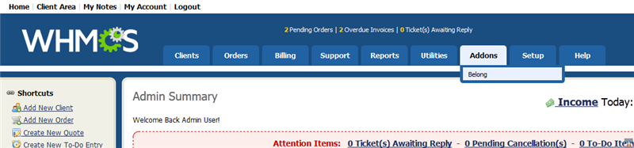
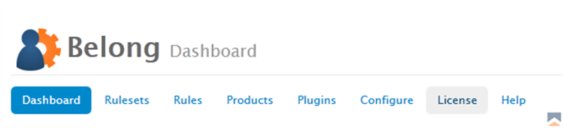
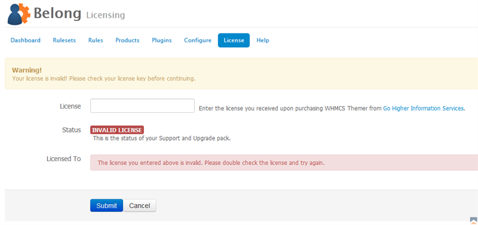
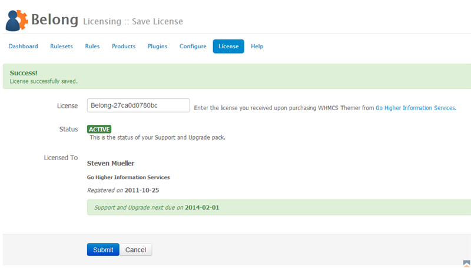
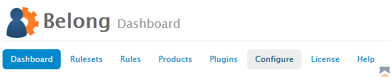

### License Configuration

Prior to using Belong for the first time, you will need to enter the license associated with your product.

An invalid license will result in the inability to save any settings.

Note you cannot upgrade Belong to a release that comes after the expiration date of your Support and Upgrade Pack

To enter your license:

1. Locate your license for Belong.  If you don't have your license available, you can log into our site and locate it under ''My Products''.
2. In the backend of WHMCS go to _Addons Belong_. 
{japopup type="image" content="media/gitdocs/belong/installupgrade_guide/assets/qs-license-01.png" width="1024" title="Addons > Belong"}
{/japopup}
3. Click on the _License_ link. 
{japopup type="image" content="media/gitdocs/belong/installupgrade_guide/assets/qs-license-02.png" width="1024" title="Belong Navigation Bar"}
{/japopup}
4. Enter your license in the _License_ field and click _Save_. 
{japopup type="image" content="media/gitdocs/belong/installupgrade_guide/assets/qs-license-03.png" width="1024" title="Belong License Page"}
{/japopup}
5. Once you have saved it, you should see a successful save message along with your license in green. 
{japopup type="image" content="media/gitdocs/belong/installupgrade_guide/assets/qs-license-04.png" width="1024" title="Belong License Page Saved"}
{/japopup}

### Product Configuration

To configure the product for first use:

1. Locate your license for Belong.  If you don't have your license available, you can log into our site and locate it under _My Products_.
2. In the backend of WHMCS go to _Addons _Belong_. 
{japopup type="image" content="media/gitdocs/belong/installupgrade_guide/assets/qs-license-01.png" width="1024" title="Addons > Belong"}
{/japopup}
3. Click on the _Configure_ link. 
{japopup type="image" content="media/gitdocs/belong/installupgrade_guide/assets/qs-configure-01.png" width="1024" title="Belong Navigation Bar"}
{/japopup}

The configuration settings are defined as follows:

*Enable* 
This field actually enabled or disables the product globally.

*API User* 
This field allows you to select which admin user to make system level calls to your local WHMCS. This permits you to audit the system.

*Show Hidden Products* 
This permits you to display products that you have set as hidden in WHMCS. This is useful to enable if you have products inaccessible to your clients. If once hidden you dont want to see them again, you can simply tick this and the product will not display in the product dropdown selection.

{japopup type="image" content="media/gitdocs/belong/installupgrade_guide/assets/qs-configure-02.png" width="1024" title="Belong Configuration"}
{/japopup}