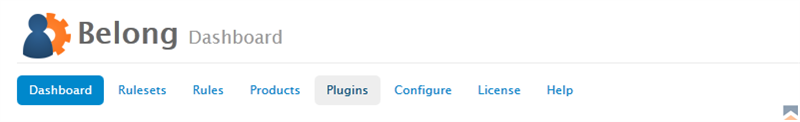
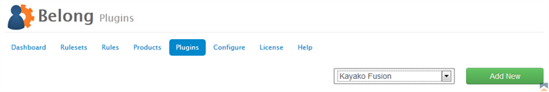

### Adding New Plugins

To add a new plugin to Belong:

1. From the Belong Addon Module in WHMCS, click on _Plugins_ 
{japopup type="image" content="media/gitdocs/belong/installupgrade_guide/assets/mp-01.png" width="1024" title="Belong Select Plugins"}
{/japopup}
2. Next on right side you will see a drop down field containing the available plugins.  Select the plugin you want to add and click _Add New_. 
{japopup type="image" content="media/gitdocs/belong/installupgrade_guide/assets/mp-02.png" width="1024" title="Belong Add New Plugin"}
{/japopup}

### Configuring Plugins

#### Joomla!

The Joomla! plugin requires that the system plugin be installed, enabled and the API Token set in order to function.  The configuration settings are as follows:

* *Connection Name* - Enter a name to easily identify this connection when selecting in a drop down list.
* *Connection Enabled* - Indicate if this connection should be active or not
* *Joomla URL* - Enter the URL to the front end of your site. Do not include any filenames or language sef that may be added to your URL by Joomla. Ensure that you also include the proper scheme (http / https).
* *API Token* - Enter the unique token you created in the System - Belong plugin that you installed into Joomla. This token must match exactly.

#### Kayako Fusion

The configuration settings are as follows:

* *Connection Name* - Enter a name to easily identify this connection when selecting in a drop down list.
* *Connection Enabled* - Indicate if this connection should be active or not
* *API URL* - Enter the URL to your API interface with Kayako Fusion. This can be found in the admin settings under API.
* *API Key* - Enter the API Key from your Kayako Fusion installation. This can be found in the admin settings under API.
* *API Secret* - Enter the API Secret from your Kayako Fusion installation. This can be found in the admin settings under API (note - this value is really long).
* *Default Group* - Select the default group to use in your rules. The default group is necessary because when a user is dropped from a higher group, they must be added back to the default group or Fusion will not work properly.

#### Mailchimp

The configuration settings are as follows:

* *Connection Name* - Enter a name to easily identify this connection when selecting in a drop down list.
* *Connection Enabled* - Indicate if this connection should be active or not
* *API Key* - This is the api key from your account which can be found at [http://admin.mailchimp.com/account/api/|http://admin.mailchimp.com/account/api/]
* *Use SSL* - Do you want to use SSL across the API to Mailchimp (why not, right?)

#### vBulletin

The configuration settings are as follows:

* *Connection Name* - Enter a name to easily identify this connection when selecting in a drop down list.
* *Connection Enabled* - Indicate if this connection should be active or not
* *Database Hostname* - Enter the database hostname for the vBulletin connection. Usually defaults to localhost.
* *Database Username* - Enter the username used to connect to the vBulletin database.
* *Database Password* - Enter the password used to connect to the vBulletin database.
* *Database Name* - Enter the name of the database found on the server.
* *Database Prefix* - Enter the prefix for the vBulletin database tables (leave blank for none).

#### WHMCS

The configuration settings are as follows:

* *Connection Name* - Enter a name to easily identify this connection when selecting in a drop down list.
* *Connection Enabled* - Indicate if this connection should be active or not
* *Admin User* - Select the admin user to be used to indicate who is making updates to clients. This option would permit you to track changes made by the selected admin user.

### Managing Plugins

Plugins are managed from the Plugins area of Belong.  You can edit or delete plugins from the list.  Please note that if you delete a plugin, all corresponding rules nad rulesets will be lost.
