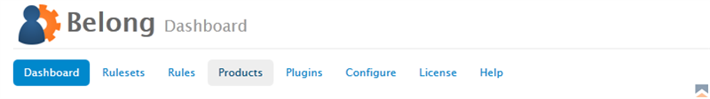
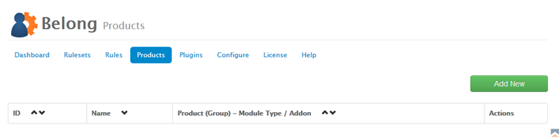
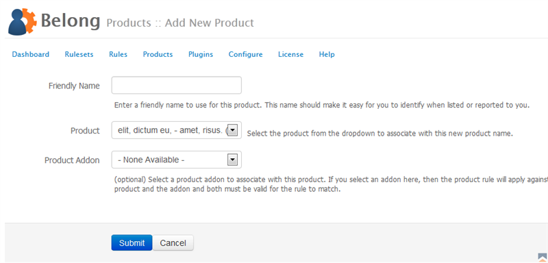

Products are set configurations within Belong that correspond to a product and an optional addon product set.  For example, you may have a product called "Simple Hosting" and those users with that product who are also active and current with their account you want to assign to a Joomla user group that gives them access to your forum.  You would use Belong to create a product reference for use in rulesets.

Why not tie directly to the WHMCS product list you may wonder... the simple answer is it provides for future expansion into other product areas such as domain names.  It also allows for eventually tying into other applications to retrieve product lists.  It also allows you to later change the product in WHMCS without worrying about affecting the rule (unless of course you also need to update the way that product is permissioned).

### Adding New Products

To add a new product to Belong,

1. From the Belong Addon Module in WHMCS, click on _Products_ 
{japopup type="image" content="media/gitdocs/belong/installupgrade_guide/assets/mprod-01.png" width="1024" title="Belong Select Products"}
{/japopup}
2. Next on right side you will see a green _Add New_ button.  Click on it. 
{japopup type="image" content="media/gitdocs/belong/installupgrade_guide/assets/mprod-02.png" width="1024" title="Belong Add New Product"}
{/japopup}
3. Now you can enter a name and select the product it will be associated with

The configuration values are as follows:

* *Friendly Name* - Enter a friendly name to use for this product. This name should make it easy for you to identify when listed or reported to you.
* *Product* - Select the product from the dropdown to associate with this new product name.
* *Product Addon* - (optional) Select a product addon to associate with this product. If you select an addon here, then the product rule will apply against both the product and the addon and both must be valid for the rule to match. {japopup type="image" content="media/gitdocs/belong/installupgrade_guide/assets/mprod-03.png" width="1024" title="Belong Add New Product Screen"}
{/japopup}

### Managing Products

Products are managed in the Products area of Belong.  You can edit or delete products from the list, and you may sort them by name or product name.  Please note that if you delete a product, all corresponding rulesets utilizing the product will need to be reconfigured.