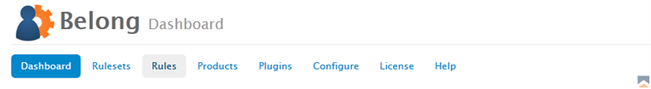
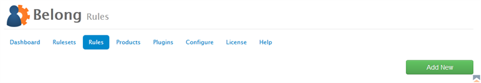
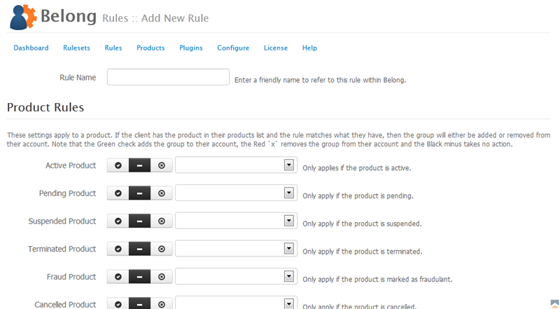
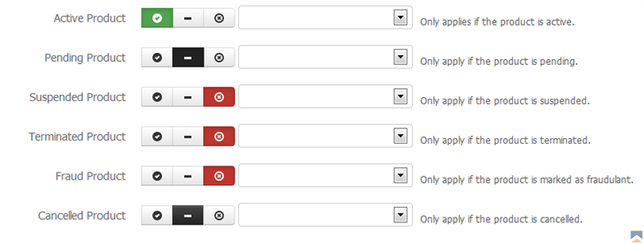

Rules tell Belong what actions to perform.  Rules apply to user groups that are retrieved from your plugins and actions are then assigned to be done based on a product status.

### Adding New Rules

To add a new product to Belong:

1. From the Belong Addon Module in WHMCS, click on _Rules_ 
{japopup type="image" content="media/gitdocs/belong/installupgrade_guide/assets/rules-01.png" width="1024" title="Belong Select Rules"}
{/japopup}
2. Next on right side you will see a green _Add New_ button.  Click on it.  
{japopup type="image" content="media/gitdocs/belong/installupgrade_guide/assets/rules-02.png" width="1024" title="Belong Add New Rule"}
{/japopup}
3. Now you can configure the rule the configuration values are as follows:  
{japopup type="image" content="media/gitdocs/belong/installupgrade_guide/assets/rules-03.png" width="1024" title="Belong Manage Rule Screen"}
{/japopup}
 
* *Rule Name* - Enter a friendly name to refer to this rule within Belong.
* *Product Rules* - The rules in the dropdown fields and their associated actions apply only to a product that is matched up to this rule.
* *Addon Rules* - The rules in the dropdown fields and their associated actions apply only to a product that also has been configured with a product addon.

### Understanding Actionsets

When we refer to an ''actionset'' we are referring to the action and rule configuration.  One action to one rule as illustrated below. 
{japopup type="image" content="media/gitdocs/belong/installupgrade_guide/assets/rules-04.png" width="1024" title="Rule Action Set"}
{/japopup}

The best way to configure actionsets is to use the pattern shown in the image below.  
{japopup type="image" content="media/gitdocs/belong/installupgrade_guide/assets/rules-05.png" width="1024" title="Belong Best Configuration"}
{/japopup}

Use the pattern against ONE permission group in whatever plugin you are applying against.  For example, let say you have a permission group in Joomla called ''Forum Users'', you would select that Joomla permission group in each of the drop down fields for this rule, and select the green and red buttons for the appropriate actions.

* *Green Check* - This setting tells Belong to add a user to the associated permission group.
* *Black Dash* - This setting tells Belong to ignore the action.  This is best used for Pending and Cancelled Products generally.
* *Red "X"* - This setting tells Belong to drop a user from the associated permission group.

Actionsets are gathered together for each user when the permissions are updated, and performed in a specific order:

1. First users current groups are gathered from the associated plugin.
2. Next any groups that a user should be dropped from will be applied against the current list.
3. Finally any groups a user should be added to will be applied against the list.

Should a user be dropped and also added to the same permission group due to the products and rulesets as you have them configured, the net result is that the user will be added to the group if they didn't already belong to it.  A dropped group and associated add group does not cancel one another out but instead are applied in sequence - first dropped then added.

### Rules in Plugins

Each plugin handles rules differently.

* *Joomla* - Joomla permits a user to belong to multiple groups at the same time
* *Kayako Fusion* - Fusion only permits a user to belong on one group at a time.  As a result you will have to be sure to select the ''Default Group'' in the plugin configuration to ensure if a user is dropped from a group they at least belong to the default group.
* *Mailchimp* - The Mailchimp plugin works with list segments and so a user may belong to multiple lists and segments simultaneously.
* *vBulletin* - The vBulletin plugin permits users to belong to multiple groups simultaneously.
* *WHMCS* - The WHMCS application only permits a user to belong to one group at a time.  If a user is going to be dropped from a group, they will be moved to the ''- No Group -'' group.

### Managing Rules

Rules are managed in the Rules area of Belong.  You can edit or delete rules from the list, and you may sort them by name.  Please note that if you delete a rule, all corresponding rulesets utilizing the rule will need to be reconfigured.
