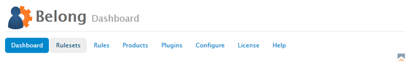
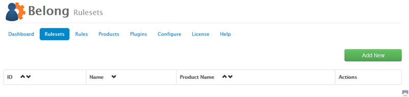
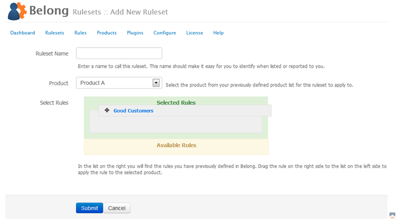

Rulesets are a group of rules associated with a product within Belong.  For example, you may have a product called "Simple Hosting" and three rules that apply against Joomla, WHMCS and Mailchimp.  You can configure a ruleset for the Simple Hosting product so that all three rules are applied when a user matches the product specified.

### Adding New Rulesets

To add a new ruleset to Belong,

1. From the Belong Addon Module in WHMCS, click on _Rulesets_  
{japopup type="image" content="media/gitdocs/belong/installupgrade_guide/assets/rulesets-01.png" width="1024" title="Belong Select Rulesets"}
{/japopup}
2. Next on right side you will see a green _Add New_ button.  Click on it.  
{japopup type="image" content="media/gitdocs/belong/installupgrade_guide/assets/rulesets-02.png" width="1024" title="Belong Add New Rulesets"}
{/japopup}
3. On the next screen you can configure the name, select the product and drag and drop rules you want to apply when a customer has the product matching in question.  
{japopup type="image" content="media/gitdocs/belong/installupgrade_guide/assets/rulesets-03.png" width="1024" title="Belong Managing Rulesets Screen"}
{/japopup}

The configuration values are as follows:

*Ruleset Name* - Enter a name to call this ruleset. This name should make it easy for you to identify when listed or reported to you.
*Product* - Select the product from your previously defined product list for this ruleset to apply to.
*Select Rules* - This is two lists, one yellow, one green, that indicate which rules to apply.  Rules can be dragged and dropped between the two lists.  The green list indicates you want to apply the rule when the product is found, rules left in the yellow list will not be applied.

### Managing Rulesets

Rulesets are managed in the Rulesets area of Belong.  You can edit or delete rulesets from the list, and you may sort them by name or product name.
