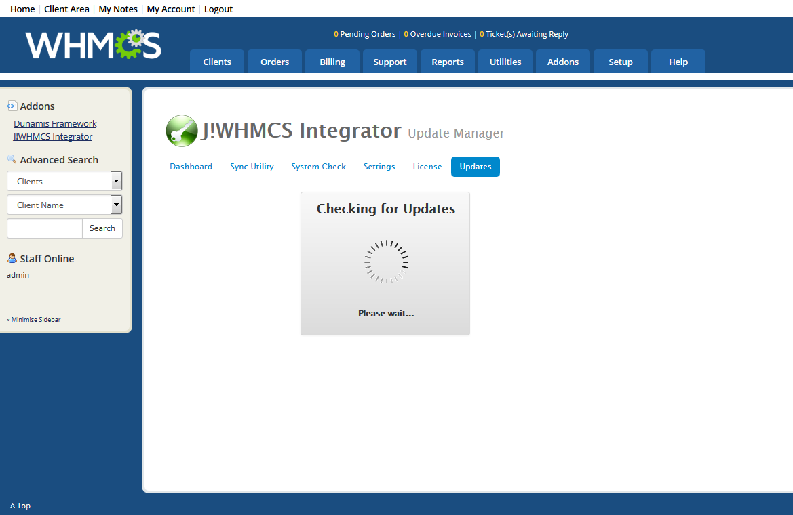

### What is a Minor Upgrade?

A minor upgrade is one that makes minor system adjustments and corrections for issues that have been discovered.  Our products are versioned so that the first digit in the version number essentially represents the product itself.  The second digit is a major revision, and the third digit is a minor revision.

A minor upgrade would be like moving from version 2.2.00 to version 2.2.01.  A major upgrade is going from version 2.1.00 to version 2.2.00.

### How to perform a Minor Upgrade - Automatic Upgrades

The easiest way to upgrade Belong is to use the built in upgrade feature.  This feature works on the Blesta portion of the product only.

To use this feature, you will need your Download ID from our site.  To access your Download ID, please follow [this guide](jblesta/howtoguides/accessdownloadid.md).

#### Blesta

To perform a minor upgrade from Blesta:

1. Log into the administrative control panel of your Blesta application
2. Navigate to Addons > Belong on the top menu
3. Click on the Updates button in the Belong page.
4. You should see a screen similar to this:  {japopup type="image" content="media/gitdocs/belong/installupgrade_guide/assets/performupdate-01.png" width="1024" title="Perform Update in WHMCS"}{/japopup}
5. If there are updates, the system will indicate in the button.
6. To update, just click the button

### How to perform a Minor Upgrade - Manual Upgrade

Another method for upgrading the system is to simply re-install the product.  This is done through the Joomla! Installation Manager in Joomla! as well as using FTP to upload files directly into Blesta.  To perform this method of installation, simply follow these sections for uploading files [found here](jblesta/installupgrade_guide/newinstalls.md):

* Upload Belong Addon Module for WHMCS