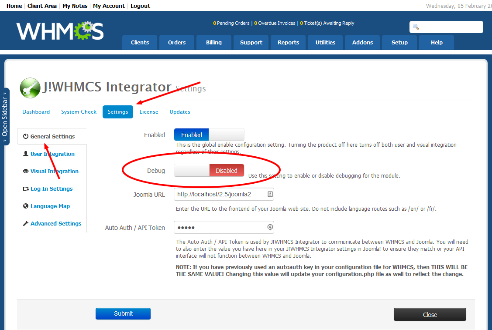
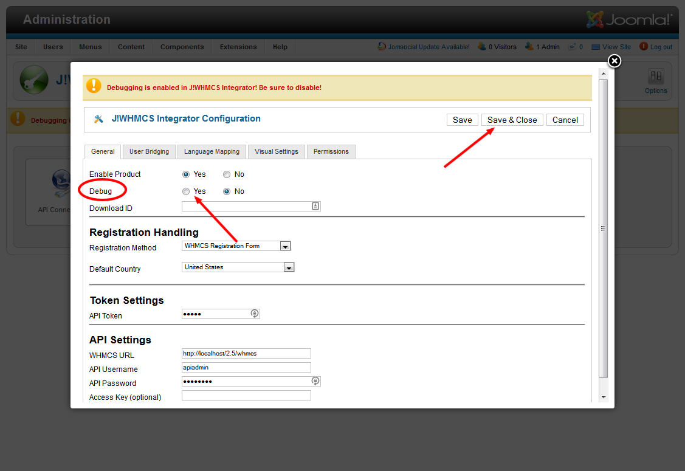

The debug feature in C!Blesta provides for simple diagnostics for the interface with C!Blesta.  Enabling debug however is not necessarily intuitive, so to do so, please follow these steps.
<!--
### Enable Debug in Blesta

To enable debugging on the Blesta side of things, follow these steps:

1. Log into your Blesta Admin area using an account that has access to the C!Blesta plugin settings.
2. Navigate to Plugins > C!Blesta > Settings
3. On the General Settings tab, click on the Debug toggle so that it is enabled 
{japopup type="image" content="media/gitdocs/cblesta/howtoguides/assets/debug-01.png" width="1130" height="760" title="Debug Mode in Blesta"}
{/japopup}
4. Hit Save

That should enable debug on Blesta for CBlesta
-->
### Enable Debug in ModX/CMS

Enabling debugging on the ModX/CMS side is also required if you want to troubleshoot any visual integration issues (for example if the site isn't wrapping properly or a module isn't appearing as expected).  To enable it, follow these steps:

1. Log into your ModX/CMS administrator area using an account that has access to the C!Blesta parameters (typically a super user account).
2. Navigate to Components > C!Blesta and click on the Options button on the top navigation bar for the component.
3. Once in there, find the Debug option on the General tab and click on Yes 
{japopup type="image" content="media/gitdocs/cblesta/howtoguides/assets/debug-02.png" width="1130" height="780" title="Debug Mode in ModX/CMS!"}
{/japopup}
4. Hit Save and Close

Your C!Blesta is now in debug mode on ModX/CMS.

### Important Note

Be sure to disable the debug mode when you are done to prevent the public from accessing it or seeing debug messages on the front end of your site.
