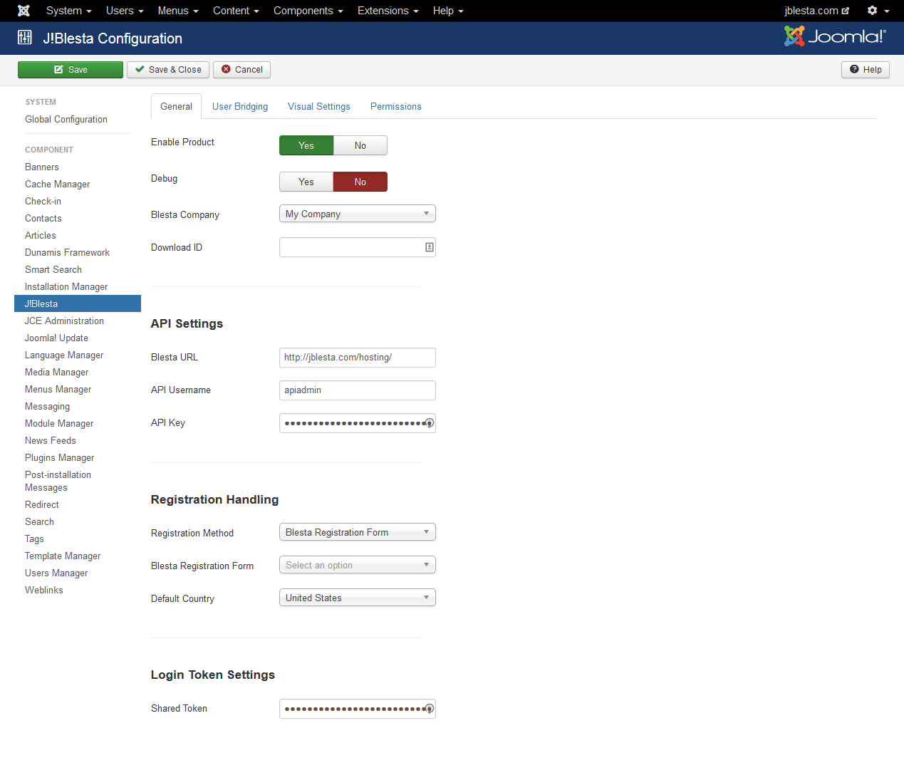
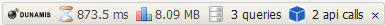
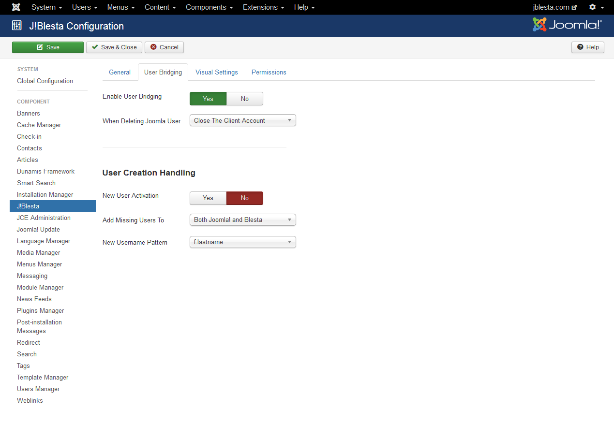
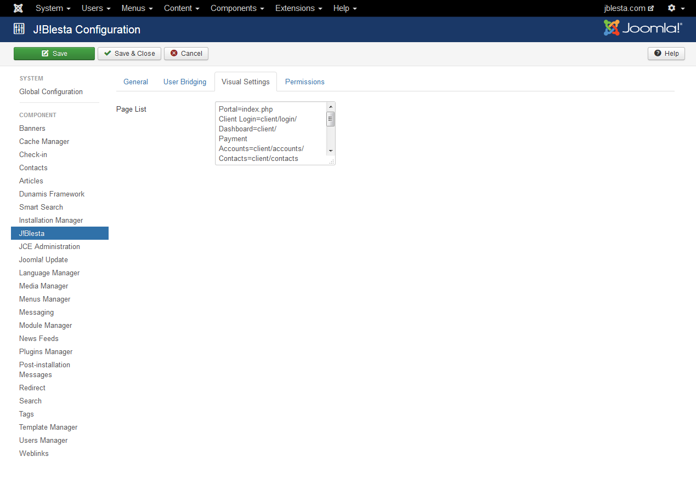

### Configuration In Depth:  Modx/Concrete5!

There are two locations for accessing settings for C!Blesta, Modx/Concrete5! and Blesta.  This document concerns accessing the configuration values for the Modx/Concrete5! portion of the installation.

* [Accessing Settings](#accessing-settings)
* [General Tab](#general-tab)
* [User Bridging Tab](#user-bridging-tab)
* [Visual Settings Tab](#visual-settings-tab)

### Accessing Settings

To access the settings for the C!Blesta product in Modx/Concrete5!, follow these steps:

1. Log into the backend of your Modx/Concrete5 CMS site using a Super Administrator account.
2. Click on Components > C!Blesta
3. On the far right side you will see the Options button.  Click on that button.
4. You should now see the settings for the C!Blesta.

### General Tab

The settings in the General Tab look similar to this:  
{japopup type="image" content="media/gitdocs/cblesta/installupgrade_guide/assets/jconfig-general.png" width="1024" title="Modx/Concrete5! Configuration:  General Tab"}
{/japopup}

#### Global Settings

##### Enable Product

This is a global switch that controls the product on Modx/Concrete5!.  If this is not enabled, the product will not operate at all.

##### Debug

This setting enabled the Dunamis debug bar which allows for easier troubleshooting and assists in determining issues should any arise.  The debug bar looks like this 

You can see it provides some useful information about what is happening including any calls to the Blesta system.  You can click on the API Calls link in the bar to get more details about what is called and what is being returned.

##### Blesta Company

Once your API is connecting to Blesta, this option will be populated with any companies you have created in your Blesta application.  This permits you to tie your Modx/Concrete5! install to a specific company created within your Blesta application.

##### Download ID

This is your Download ID which is available [from our site](cblesta/howtoguides/accessdownloadid.md).

#### API Settings

##### Blesta URL

This setting is the URL to the front end of your Blesta system.  This value MUST be a fully qualified domain.  An example of a FQDN is:

<code>http://cblesta.com/hosting/</code>

Not including the scheme or full path to your Blesta application will result in the system failing to operate properly

##### API Username

These are configured in your Blesta system.  To create the user, [follow these instructions](cblesta/howtoguides/createapiuser.md).  Be sure this is accurate.

##### API Key

This is created when you create your API Username in Blesta and is unique to the API user.

#### Registration Handling

##### Registration Method

This setting will tell your Modx/Concrete5 site to use either the Blesta registration form or the native (or 3rd party) registration form in Modx/Concrete5!.  Note that if you set this to Blesta and on the Blesta side you set the value to use Modx/Concrete5, you could find yourself in an endless loop, so be sure your settings are consistent in the product.

##### Blesta Registration Form

This is the registration form you create in Blesta that you would like registrations redirected to if you select the Blesta registration form method above.

##### Default Country

If you are using the Modx/Concrete5! registration form, the C!Blesta will add in the necessary address fields from Blesta so that your users can completely register on both Modx/Concrete5! and Blesta.  This setting tells C!Blesta what you expect to use as the default country in your system.

#### Login Token Settings

##### Shared Token

This setting is very important and must match what is set on the Blesta side for the product.  This token is used to create an authentication hash when the system attempts to communicate from one side or the other.  The token is never passed from one system to the other via the request, but instead should be identical on both sides so the request can rebuild the authentication hash and verify that the request is legit.

### User Bridging Tab

The settings in the User Bridging Tab look similar to this:  
{japopup type="image" content="media/gitdocs/cblesta/installupgrade_guide/assets/jconfig-user.png" width="1024" title="Modx/Concrete5! Configuration:  User Bridging Tab"}
{/japopup}

#### General Settings

##### Enable User Bridging

This setting permits you to bypass the C!Blesta when doing any user management on the Modx/Concrete5! side.  When this is disabled, users logging in from Modx/Concrete5 will not be logged into Blesta, nor will they be able to edit their Blesta profile settings from the Modx/Concrete5 user profile screen.

##### When Deleting Modx/Concrete5 User

This setting tells C!Blesta what to tell Blesta to do with the matching user in Blesta when you delete the user in Modx/Concrete5!.  Ideally you don't want to delete the user in Blesta because there are billing and service records to maintain, so the default setting is to Close the Clients account in Blesta.  This forbids the user from logging in on either system but maintains records in Blesta.

#### User Creation Handling

##### New User Activation

If a user is created by C!Blesta (either because they are created by Blesta or because they are logging in for the first time in the system and they must be created in Modx/Concrete5!), this setting tells C!Blesta if you want to override the default Modx/Concrete5! user account activation mechanism.  If you set this to No, then new users created by C!Blesta will NOT be required to authenticate their email address prior to logging into the Modx/Concrete5! system.  If you set this to Yes, then the default action that you have set in the user configuration of Modx/Concrete5! will take place.

##### Add Missing Users To

This setting tells C!Blesta that you intend to add missing users to one system, neither systems or both systems.  The default is to set this to create users on both Modx/Concrete5! and Blesta.  A user may be missing if they are created in Blesta at the time of check out but for some reason Modx/Concrete5 didn't create the user then.  Or if you have only just recently installed the product and have users in Blesta but not in Modx/Concrete5! yet.

##### Create Username Method

When creating a new user in Modx/Concrete5!, the C!Blesta must know how to generate the username.  Since Modx/Concrete5! doesn't necessarily use an email address for logging in and Blesta doesn't by default ask for a username, the username can be created in a couple of ways.  The default setting is to defer to Blesta, so whatever setting you have set in C!Blesta for generating the username will be used.

##### New Username Pattern

This setting works with the previous setting, and is only used when the Create Username Method is set to Use Pattern Below.  This pattern will rely on information sent by the Blesta system when creating the user to build the username.

### Visual Settings Tab

The settings in the Visual Settings Tab look similar to this:  
{japopup type="image" content="media/gitdocs/cblesta/installupgrade_guide/assets/jconfig-visual.png" width="1024" title="Modx/Concrete5! Configuration:  Visual Settings Tab"}
{/japopup}

##### Page List

This setting allows you to predefine potential pages to link to.  This page map is used by the C!Blesta > Link Menu Item Type and will appear in the drop down list under Link Options.  To create your own links, you want to use a name with an equal sign followed by the URL to the page you are going to.

Note that this will only work on NEW menu items, existing menu items do not rely on this setting.

