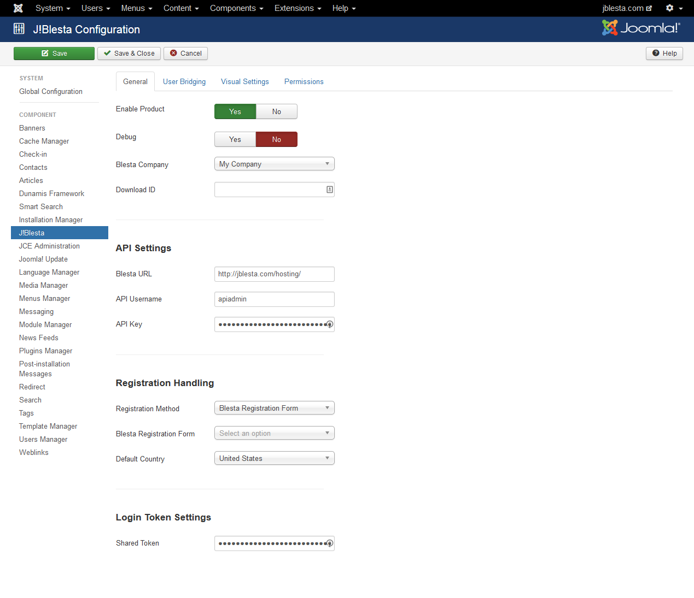

C!Blesta has settings located in two different places, those on the Modx/Concrete5 side and those on the Blesta side.

### Quick Setup on the Modx/Concrete5 Side

After installing the component portion of the C!Blesta, you will have installed not just the component but also a series of plugins.  Begin configuration after the installation with the component settings.

#### Access the Component Settings

To access the component settings:

1. Log into the back end of your Modx/Concrete5! CMS. 
{japopup type="image" content="media/gitdocs/cblesta/installupgrade_guide/assets/config-joomla-01.png" width="1024" title="Log Into Modx/Concrete5"}
{/japopup}
2. Navigate in the backend of Modx/Concrete5 to Components > C!Blesta. 
{japopup type="image" content="media/gitdocs/cblesta/installupgrade_guide/assets/config-joomla-02.png" width="1024" height="375" title="Select C!Blesta"}
{/japopup}
3. Click on the 'Options' button on the top right side of the page. 
{japopup type="image" content="media/gitdocs/cblesta/installupgrade_guide/assets/config-joomla-03.png" width="1024" height="330" title="Select Options"}
{/japopup}

Now you will be in the component settings

#### Initial Configuration

Assuming you have not configured the API yet to tie into Blesta, follow these steps: 
{japopup type="image" content="media/gitdocs/cblesta/installupgrade_guide/assets/config-joomla-04.png" width="1024" title="Options"}
{/japopup}

1. *Enable Product* 
Set this to 'Yes' to enable the C!Blesta product
2. *Debug* 
Set this to 'Yes' initially to permit debug testing for the visual integration.  Once everything is connecting, be sure to set this to 'No'
3. *Blesta Company* 
When you first configure the product, this setting will not have any options.  After you have connected the API, you will be able to select which company this install ties to.
4. *Download ID* 
This is the download ID found on our site after you log into our site.  This permits you to download updates to our product when they become available automatically.
5. *Shared Token* 
This is important - you must set a token here.  You will need this for the Blesta portion of the configuration as well (both sides must have the same token for verification and authentication purposes).

#### Connect your API from Modx/Concrete5 into Blesta

There are a number of steps to accomplish this, and they are outlined in the following guides.  Please follow them in order:

1. [Create An API User in Blesta](cblesta/howtoguides/createapiuser.md)
2. [API Connection Manager in Modx/Concrete5](cblesta/howtoguides/apicnxnmgrinjoomla.md)

#### Create A Menu Item

The last step on the Modx/Concrete5 side is to create a menu item for C!Blesta to use.  The purpose of this menu item is two fold:

1. Provides a link to your Blesta app for your customer to click on.
2. Provides a menu item to assign modules to in order to have them rendered around your Blesta app.

This menu item can have modules of any access level assigned to it, and assuming the customer that is logged in on the front end of the Blesta application has the appropriate access level, will be rendered around the Blesta content.  To create the menu item, simply go to your Main Menu or any menu you choose, create a New Menu item and select a C!Blesta > Link Type of menu item.  Under the options of the menu item, select which page to have the customer land on when they click the link.

You will then select this menu item later in the Blesta configuration of things.

### Walk Through of Settings on Blesta Side

#### Accessing the Settings

To access the settings for the C!Blesta on the Blesta side, follow these simple steps.

1. Log into the back end of your Blesta application using an Administrator level account. 
{japopup type="image" content="media/gitdocs/cblesta/installupgrade_guide/assets/config-blesta-01.png" width="1024" title="Log Into Blesta"}
{/japopup}
2. If you are installing the product at this time, click on Settings > Available Plugins and then click on Install.  If you have already installed the product and need to access the settings, click on to Settings > Available Plugins 
{japopup type="image" content="media/gitdocs/cblesta/installupgrade_guide/assets/config-blesta-02.png" width="1024" title="Navigate to Plugins"}
{/japopup}
3. Click on Manage next to the C!Blesta plugin 
{japopup type="image" content="media/gitdocs/cblesta/installupgrade_guide/assets/config-blesta-03.png" width="1024" title="Manage Plugin"}
{/japopup}
4. Click on the Settings link in the navigation row for C!Blesta. 
{japopup type="image" content="media/gitdocs/cblesta/installupgrade_guide/assets/config-blesta-04.png" width="1024" title="Select Settings"}
{/japopup}

#### Initial Configuration

The first step you want to take is to configure the API connection between Blesta and Modx/Concrete5.  In order for this to work you must first do the following in Modx/Concrete5:

* Ensure that the System - C!Blesta plugin is activated
* Set and know what the Token is in the C!Blesta Extension Options
* Be aware of any SSL or language setting requirements in Modx/Concrete5.

With those requirements set you will need to go through this process:

##### General Settings

When you go to the settings page, the first screen you will see looks similar to this one: 
{japopup type="image" content="media/gitdocs/cblesta/installupgrade_guide/assets/config-blesta-04.png" width="1024" title="General Settings"}
{/japopup}

To start configuring the application:

1. Toggle the Enabled setting to 'Enabled'
2. Toggle the Debug setting to 'Enabled'
3. In the Modx/Concrete5 URL enter the Fully Qualified URL to your Modx/Concrete5 site.  This would be similar to http://www.yourmodxsite.com.

<strong>Modx/Concrete5 URL Requirement</strong>

If you don't include the scheme (http://) to your site, the API *WILL NOT CONNECT* and you will have issues.

4. Enter the token you have set in Modx/Concrete5 in the field for Auto Auth / API Token.
5. Press the Submit button below to save these settings.

To verify that the API is connecting properly, click on the 'System Check' link on the naviation row for C!Blesta.  You should see the following display if everything is connecting properly between Blesta and Modx/Concrete5:

{japopup type="image" content="media/gitdocs/cblesta/installupgrade_guide/assets/config-blesta-05.png" width="1024" title="System Check - All Good"}
{/japopup}

##### User Integration

For most customers, nothing will need to be modified here.

##### Visual Integration

There are several common adjustments to make in the Visual Integration section after the API starts connecting.

1. *Enable jQuery* 
This setting by default will rely on the Blesta jQuery because Blesta requires the jQuery library to be embedded when the site is rendered.  For most modern Modx/Concrete5! sites however, jQuery is being included in the template already and embedding it again can cause conflicts and issues.  If your Modx/Concrete5! site already embeds the jQuery library, you can toggle this to 'Use Modx/Concrete5s jQuery' to avoid potential Javascript conflicts, or set to Do Nothing if you are unsure if you need it or not.
2. *URL for Images / CSS / JS* 
For customers that have Blesta installed on a subdomain and have an SSL certificate for that subdomain but not for the domain Modx/Concrete5 is installed on, you will want to pay attention to this setting.  This setting permits you to set the images, css and javascript links to another, secured location so your SSL doesn't appear broken.
3. *Menu Item* 
After the API starts connecting, this drop down will be populated with active menu items from your Modx/Concrete5 site.  Select a menu item that you have created in Modx/Concrete5 (preferably a menu item of type JBlesta > Link Type).  This menu item you select can be configured to include modules which will then display around Blesta.
4. *Reset CSS* 
C!Blesta includes a reset.css file that attempts to reset styles.  For some Modx/Concrete5! template / Blesta template combinations this isn't necessary, so if your Blesta content appears very crunched or out of place after integration, try disabling this setting.
5. *Show Header* 
Disable this setting to hide the header of the Blesta page containing the large page title and Return to Portal / Log In links. Note: This will also hide the links that appear directly beneath once logged in - be sure to provide some way for your clients to access their account details.

{japopup type="image" content="media/gitdocs/cblesta/installupgrade_guide/assets/config-blesta-06.png" width="1024" title="Visual Settings"}
{/japopup}

##### Advanced Settings

Most customers won't need to modify anything in here right off the bat.  The only setting you may want to adjust would be:

* *Pass User Agent* 
With mod_security and certain firewall solutions, connections can be dropped if there isn't a user agent passed along by the C!Blesta when retrieving the site.  You may want to set this to Enabled if you are encountering issues getting the API to connect or are getting a 406 error code when debugging the visual settings.

{japopup type="image" content="media/gitdocs/cblesta/installupgrade_guide/assets/config-blesta-07.png" width="1024" title="Advanced Settings"}
{/japopup}