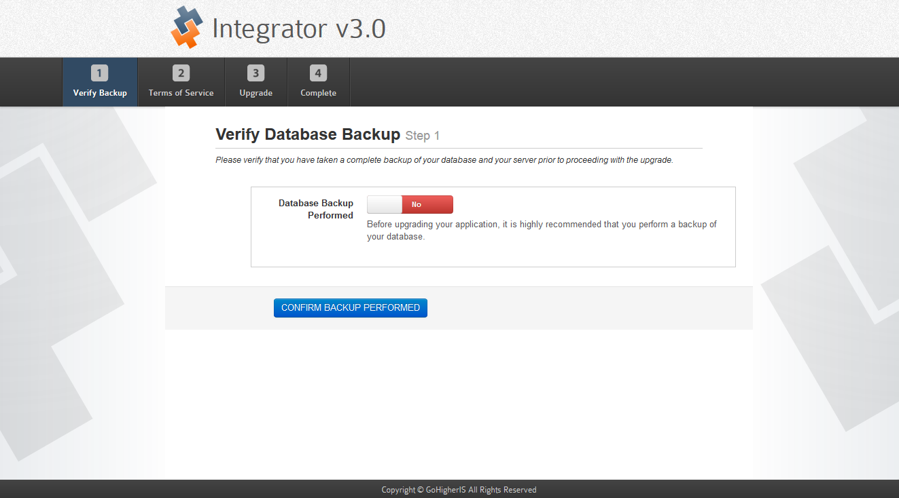
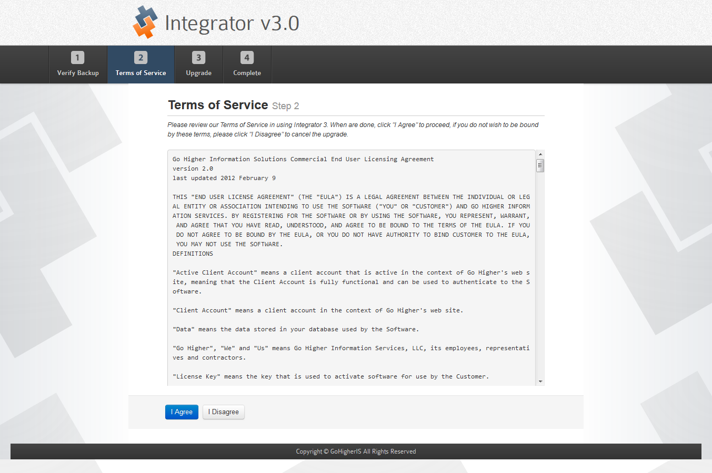

## Integrator 3: <small>Minor Upgrades</small>

### What is a Minor Upgrade?

A minor upgrade is one that makes minor system adjustments and corrections for issues that have been discovered.  Our products are versioned so that the first digit in the version number essentially represents the product itself.  The second digit is a major revision, and the third digit is a minor revision.

A minor upgrade would be like moving from version 3.1.04 to version 3.1.05.  A major upgrade is going from version 3.0.19 to version 3.1.00.

### How to perform a Minor Upgrade

There are two ways to upgrade the Integrator 3 platform: using the Automatic Update feature or to Manually Update the system.

#### Automatic Update Feature

To use the Automatic Update feature, you will need your Download ID from our site.  To access your Download ID, please follow [this guide](common/accessdownloadid.md) then follow this procedure:

1. Log into your [Integrator 3 Admin Area](integrator3/howtoguides/accessadminarea.md).
2. Click on the *Configuration* drop down menu and select *General Settings*.
3. Click on the *Go Higher Settings* tab on the left side and you will see a field for the *Download ID*.
4. Enter your Download ID and press the *Save Settings* button at the bottom.

To check for updates and perform any updates:

1. Log into your [Integrator 3 Admin Area](integrator3/howtoguides/accessadminarea.md).
2. Click on the *Help* drop down menu and select *System Status*.
3. Click on the *Updates* tab on the left side and you will see the various connections with your Integrator 3 application as well as their version and status.  You may also press the *Refresh* button at the top to get the latest update from our server.
4. If any of your connections require updating, you will see a button: 

5. Click on the *Update Now* button and if the connection supports an automatic update it will be performed for you.

#### Manual Updates

To do a manual update, you will want to follow the **[Download Integrator 3](integrator3/installupgrade_guide/newinstalls.md)** procedure and then:

1. Navigate into the Integrator folder you extracted and extract the archive contained within it.
2. FTP the core files to your Integrator 3 application folder.

#### Integrator 3 Core Application Update Procedure

When you update the Integrator 3 Core Application automatically, assuming the upgrade was downloaded and installed properly, you will be taken to the upgrade screen.  If you upgrade via a manual method, you will access the upgrade screen as soon as you log into the Integrator 3 backend.

1. {japopup type="image" content="media/gitdocs/integrator3/installupgrade_guide/assets/minorupgrade-coreapp-1.png" width="1323" height="734" title="Verify Database Backup"}{/japopup}
This first screen asks you to confirm that you have backed up your Integrator 3 database.  Toggle the switch to *Yes* and press *CONFIRM BACKUP PERFORMED*.
2. {japopup type="image" content="media/gitdocs/integrator3/installupgrade_guide/assets/minorupgrade-coreapp-2.png" width="1353" height="901" title="Terms of Service"}{/japopup}
The next screen asks you to reconfirm the Terms of Service for using the Integrator 3 product.  Press *I Agree* to continue.

You have now completed the upgrade procedure for your Integrator 3 core application.  You will need to also perform upgrades on any connections you are using.
