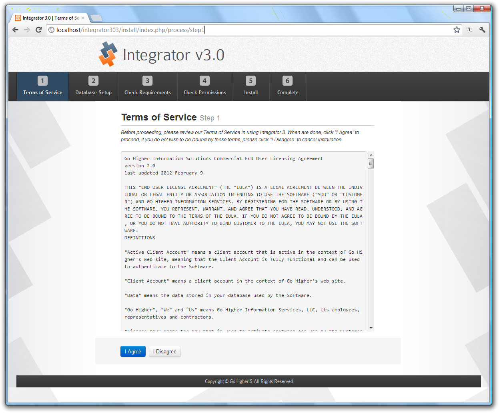
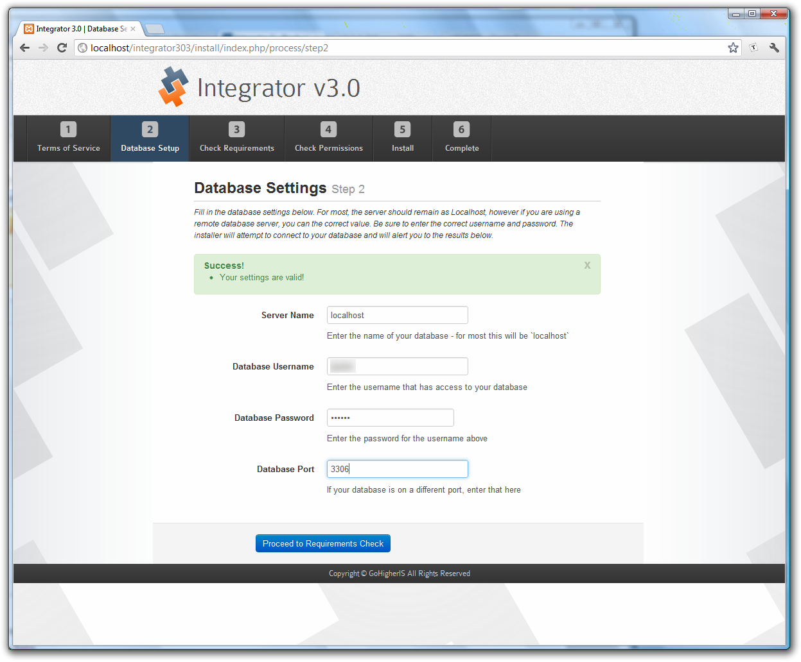
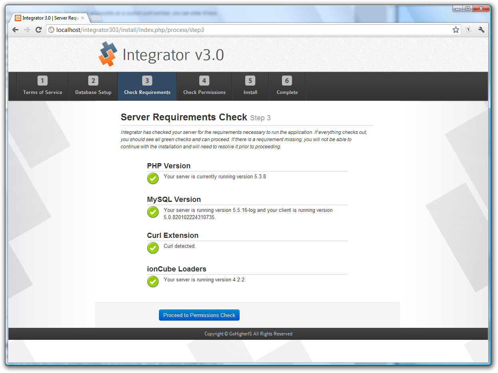
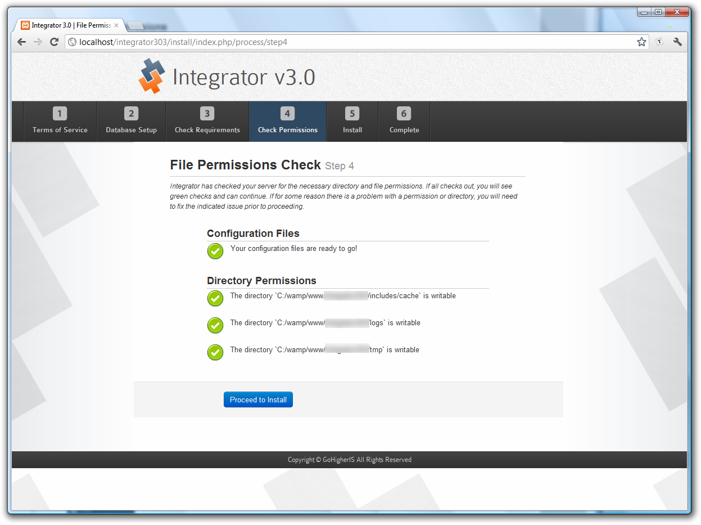
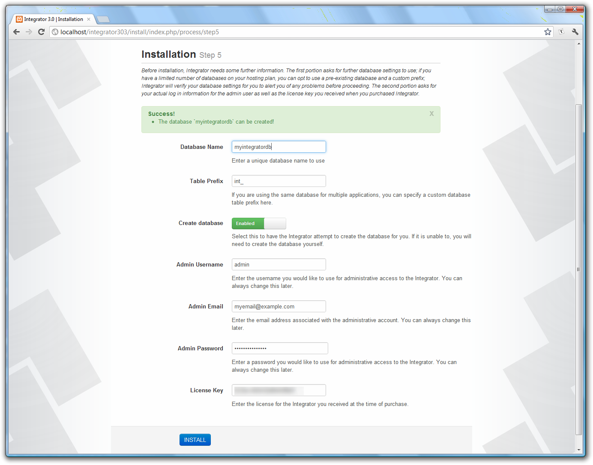
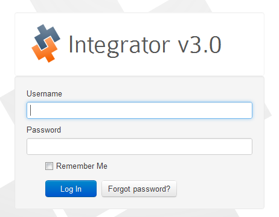

## Integrator 3: <small>New Installs</small>

Before proceeding with any portion of the installation of Integrator 3, please be sure to read the documentation in their entirety.

### Download Integrator 3

1.  Log into our web site using your account credentials.  You may use either your email address and password or your username and password.
2.  Navigate to the *Downloads* link on the main menu and select the latest release of Integrator 3 for download.
3.  Select the file called *Complete Integrator 3 Archive* and save the file to your local computer.
4.  Navigate to the folder the archive was saved into and extract the contents of that folder into a convenient location.
5.  Wherever you extract the archive you should see five folders: Fusion, Integrator, Joomla, WHMCS and Wordpress

The folder `Integrator` is the core application, and that is what this page will walk you through installing.  For instructions on installing the individual connectors, please see the following:

* [Kayako Fusion](integrator3/installupgrade_guide/newfusion.md)
* [Joomla! 3.x](integrator3/installupgrade_guide/newjoomla3.md)
* [WHMCS v6](integrator3/installupgrade_guide/newwhmcs6.md)
* [Wordpress 4](integrator3/installupgrade_guide/newwordpress4.md)

### Gather Requirements

To complete the installation of the core application, you will need to have the following information:

* **FTP Credentials** - you will need to upload files to your server
* **Database Connection** - you will need to have either a clean database or an existing database with a username and password to access it.
* **Integrator 3 License** - you should have been emailed a copy of your Integrator 3 license, if not you can log into our [Client Portal|https://client.gohigheris.com/clientarea.php] to retrieve it.
* **Folder Location** - you will want to install the core application into a folder that is friendly for your visitors as they may see the folder in the URL when they log in or when they register.

<strong>Recommended Folder Name</strong> 
We recommend a folder name of `accounts` or `my` or something generic to use.  We do not recommend using `integrator` as your installation folder, particularly if you are installing Integrator 3 as a subfolder of a Joomla! installation - this will cause problems when you install the Joomla! component.

### Installation Procedure

Now you are ready to install Integrator 3.

1. Navigate into the Integrator folder you extracted and extract the archive contained within it.  These are the core files.
2. FTP the core files to your server in the Folder Location you determined above.
3. In a browser, navigate to the installation folder.  For example, if you uploaded the files to a subfolder called `accounts`, navigate to http://yourdomain.com/accounts.  You should be shown a screen similar to the one to the right.  Once you arive at that screen, accept the Terms of Service to proceed.
{japopup type="image" content="media/gitdocs/integrator3/installupgrade_guide/assets/install-coreapp-1.png" width="1247" height="1032" title="Terms of Service"}{/japopup}
4. The next step is the database configuration.  Enter the credentials for your database, as you do the system will check the credentials on the fly to let you know if you can proceed or not.  If it checks out, press the Proceed to Requirements Check.
{japopup type="image" content="media/gitdocs/integrator3/installupgrade_guide/assets/install-coreapp-2.png" width="1247" height="1032" title="Database Credentials"}{/japopup}
5. Next is a check of your system to ensure you have adequate PHP, MySQL and extensions installed.  For most this will all be okay, simply click the Proceed to Permissions Check to continue.
{japopup type="image" content="media/gitdocs/integrator3/installupgrade_guide/assets/install-coreapp-3.png" width="1247" height="1032" title="Requirements Check"}{/japopup}
6. Now the installer will check some file permissions to ensure it can write to folders and files that are needed.  Again, for most this will check out, click Proceed to Install to continue.
{japopup type="image" content="media/gitdocs/integrator3/installupgrade_guide/assets/install-coreapp-4.png" width="1247" height="1032" title="Permissions Check"}{/japopup}
7. The final step before installation is to gather your admin information as well as your database name.  The screen looks similar to the screen below.
{japopup type="image" content="media/gitdocs/integrator3/installupgrade_guide/assets/install-coreapp-5.png" width="1247" height="1032" title="Installation Questions"}{/japopup}

<strong>Database Name</strong> 
Depending on your server configuration, you may or may not be able to create a new database.  If not, you can select a database you are already using, just be sure to use a unique prefix in front to avoid conflicts with other applications using the database.

8. Complete!  You should land on the log in screen for the admin area of Integrator 3, which looks similar to this screen.
{japopup type="image" content="media/gitdocs/integrator3/installupgrade_guide/assets/install-coreapp-6.png" width="462" height="360" title="Install Complete"}{/japopup}

### Next Steps

After you have installed the product into your site, you are now read to configure the product.  Configuration must be done before your Joomla and WHMCS installations will work together.

* [Add or Change Your J!WHMCS License](Add or Change Your License)
* [Configuration Walk Through](http://)
* [Setup The Shared API Token](Setup the Shared API Token)
* [API Connection Manager in Joomla](https://support.gohigheris.com/docs/display/J25/API+Connection+Manager+in+Joomla)
