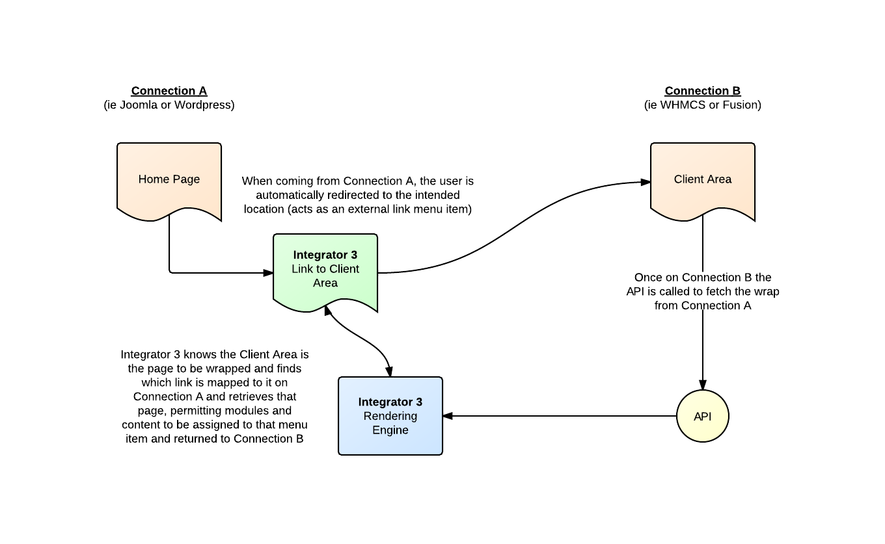

## Integrator 3: <small>Page Mapping</small>

### What is Page Mapping?

Page mapping is the concept of taking a request for a page on one connection and routing the correct visual page back to the user.

### What does that mean?

In a nutshell, page mapping permits you to use different pages from your CMS to wrap around your application, so different pages in WHMCS for instance can have different modules, menus or other content items specific to the individual page.

{japopup type="image" content="media/gitdocs/integrator3/installupgrade_guide/assets/pagemapping-concept.png" width="1360" height="837" title="Page Mapping Concept"}{/japopup}

In the example given, a Joomla or Wordpress site links over to a WHMCS or Fusion application by means of an Integrated Menu Item.  When the user is coming from the Joomla or Wordpress site, they are automatically redirected over to the correct WHMCS or Fusion page.

Once the user arrives at WHMCS or Fusion, Integrator 3 is called up to fetch the wrap for the application.  If the page mapping has been setup, then Integrator 3 will know to fetch the same menu item that the user clicked on to go to the WHMCS or Fusion site. This menu item is then wrapped around the WHMCS or Fusion site while the user will will not be aware of this, they will only see the menu item they clicked on highlighted and the site wrapping around WHMCS seamlessly.

### Benefits of using Page Mapping

In addition to the ease of not having to update individual template files when you change your web site, page mapping offers a greater degree of flexibility over other integration solutions.

#### Fine Grained Customization

If each page on the WHMCS or Fusion site has a mapped page (not necessary, but possible) then it would be literally possible to assign custom modules, menus and content to each and every page in WHMCS or Fusion from within Joomla or Wordpress. This affords a huge improvement over other integration solutions.

#### Permits User Permission Content

Integrator 3 allows you to assign access control restricted content on a mapped page and it will show up as expected if the user has that access.  For instance, a logged in user may see a menu rendered on the right side, while a user that is not logged in would not see the menu.
