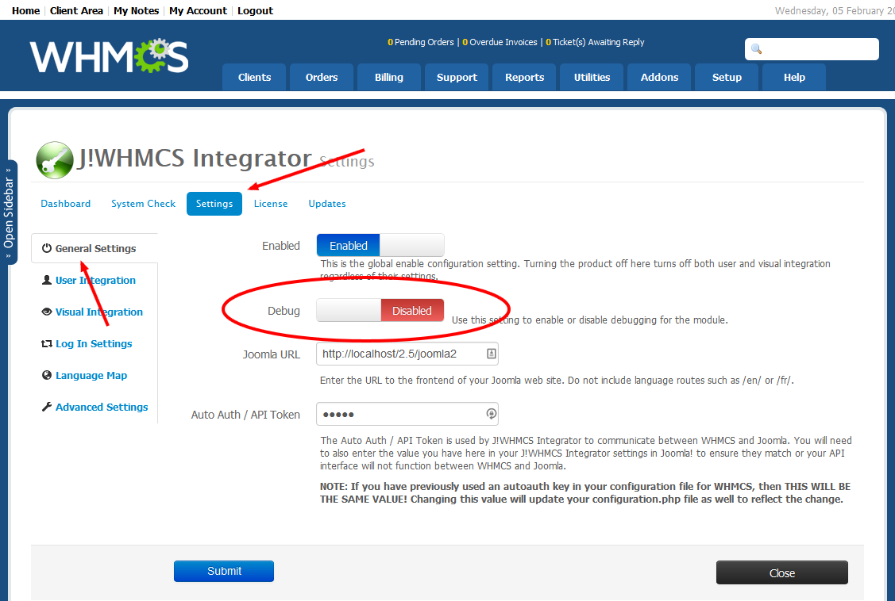
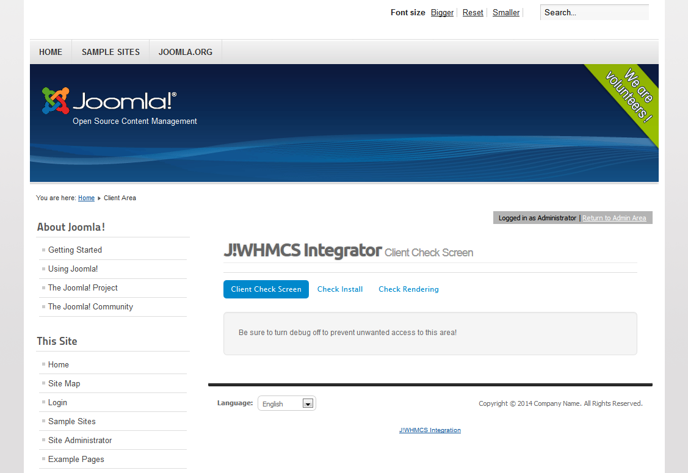

The debug feature in J!Blesta provides for simple diagnostics for the interface with J!Blesta.  Enabling debug however is not necessarily intuitive, so to do so, please follow these steps.
<!--
### Enable Debug in Blesta

To enable debugging on the Blesta side of things, follow these steps:

1. Log into your Blesta Admin area using an account that has access to the J!Blesta addon module settings.
2. Navigate to Addons > J!Blesta > Settings
3. On the General Settings tab, click on the Debug toggle so that it is enabled 
{japopup type="image" content="media/gitdocs/jblesta/howtoguides/assets/debug-01.png" width="1130" height="760" title="Debug Mode in Blesta"}
{/japopup}
4. Hit Save

That should enable debug on Blesta for J!Blesta
-->
### Enable Debug in Joomla

Enabling debugging on the Joomla side is also required if you want to troubleshoot any visual integration issues (for example if the site isn't wrapping properly or a module isn't appearing as expected).  To enable it, follow these steps:

1. Log into your Joomla administrator area using an account that has access to the J!Blesta parameters (typically a super user account).
2. Navigate to Components > J!Blesta and click on the Options button on the top navigation bar for the component.
3. Once in there, find the Debug option on the General tab and click on Yes 
{japopup type="image" content="media/gitdocs/jblesta/howtoguides/assets/debug-02.png" width="1130" height="780" title="Debug Mode in Joomla!"}
{/japopup}
4. Hit Save and Close

Your J!Blesta is now in debug mode on Joomla.

### Accessing the Debug Panel

The J!Blesta provides a debug interface to help troubleshoot problems.  To access it:

1. Be sure you have enabled debug on both Blesta and Joomla as described above.
2. In your browser, navigate to your Blesta front end, for example http://www.yourdomain.com/whmcs/
3. In the navigation bar, change the URL to read http://www.yourdomain.com/whmcs/?m=jblesta
4. You should now see a screen similar to the following image\\
{japopup type="image" content="media/gitdocs/jblesta/howtoguides/assets/debug-03.png" width="1130" height="780" title="Accessing Debug Mode"}
{/japopup}

If you see a page similar to the above then you have enabled debug mode!

### Check Install screen

{japopup type="image" content="media/gitdocs/jblesta/howtoguides/assets/debug-04.png" width="1130" height="780" title="Check Install Screen"}
{/japopup}

The check install screen provides a great deal of detail on the status of your installation.  Of particular concern to J!Blesta is your template files.  Assuming you don't have any customizations to worry about in your templates folder, you should want all the templates to be customized by J!Blesta to ensure they will work with your Joomla site.  This screen provides a file by file analysis and checks their status.  If you recently uploaded a new version of J!Blesta or Blesta, you will want to run through these to update them.

Also on this page at the bottom are environmental settings and conditions needed to operate J!Blesta properly.  If any of the environmental conditions are set to No you may experience problems with your integration.

### Check Rendering screen

{japopup type="image" content="media/gitdocs/jblesta/howtoguides/assets/debug-05.png" width="1130" height="780" title="Check Rendering Screen"}
{/japopup}

By far the most useful screen is the Check Rendering screen.  This screen gives you the URL that is being used to retrieve your Joomla page, along with the output form the curl handler.

Note that with the URL that is provided, if you have debug enabled on the Joomla side also (as described above) you can copy and paste that URL into your browser and you will see the page that is actually retrieved from Joomla by J!Blesta.

Also, the Response Code that is provided back is extremely useful.  If it is anything other than 200 then there are issues connecting to your Joomla site.  301, 302 and 303 indicate a redirection is being done by something on the Joomla side (perhaps your .htaccess file, perhaps a plugin, perhaps the menu item being retrieved is Registered but the user isn't logged in yet).  If the response code is 403 then the menu item being requested isn't accessible by a guest or that particular logged in user.  If the response code is 404, then your URL is wrong.  If it is 500 there is a bigger issue going on with the server, you'll need to look at your error logs.

If you are getting a '0' response - this indicates you have a firewall in place either at the server level or within Joomla itself as a component.  You must whitelist your server's IP address to permit J!Blesta to communicate with your Joomla site from Blesta.

### Important Note

Be sure to disable the debug mode when you are done to prevent the public from accessing it or seeing debug messages on the front end of your site.
