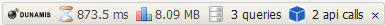
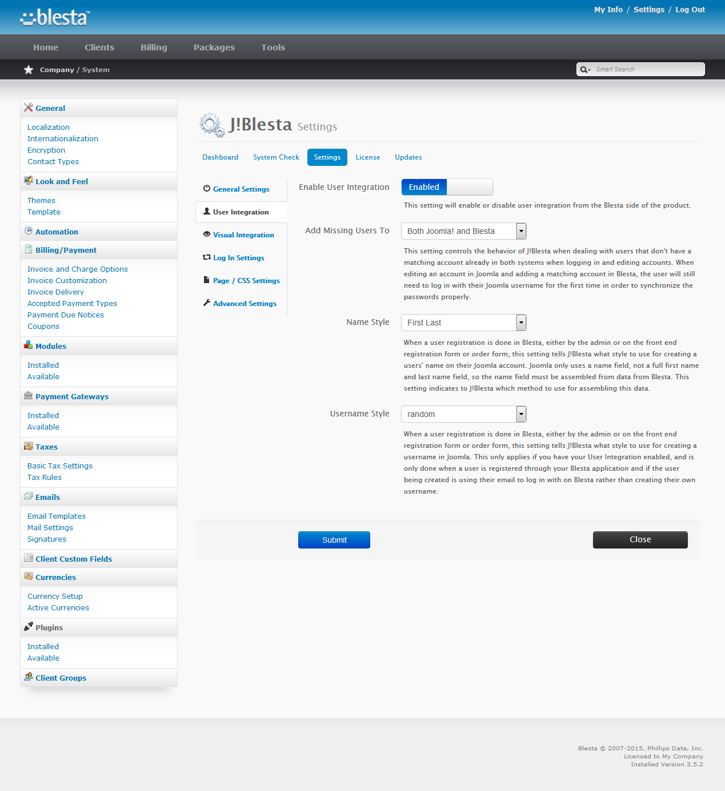
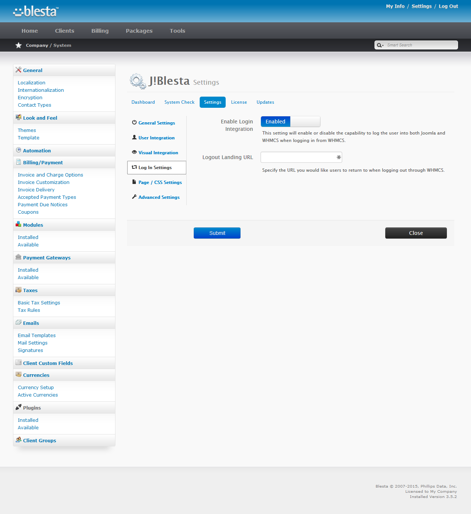

### Configuration In Depth:  Blesta

There are two locations for accessing settings for J!Blesta, Joomla! and Blesta.  This document concerns accessing the configuration values for the Blesta portion of the installation.

* [Accessing Settings](#accessing-settings)
* [General Tab](#general-tab)
* [User Integration Tab](#user-integration-tab)
* [Visual Integration Tab](#visual-integration-tab)
* [Log In Settings Tab](#log-in-settings-tab)
* [Page CSS Settings Tab](#page---css-settings-tab)
* [Advanced Settings Tab](#advanced-settings-tab)

### Accessing Settings

To access the settings for the J!Blesta product in Blesta, follow these steps:

1. Log into the back end of your Blesta application using an Administrator level account.
2. If you are installing the product at this time, click on Settings > Available Plugins and then click on Install.  If you have already installed the product and need to access the settings, click on to Settings > Available Plugins
3. Click on Manage next to the J!Blesta plugin
4. Click on the Settings link in the navigation row for J!Blesta.

### General Tab

The settings in the General Tab look similar to this:  
{japopup type="image" content="media/gitdocs/jblesta/installupgrade_guide/assets/bconfig-general.png" width="1024" title="Blesta Configuration:  General Tab"}
{/japopup}

##### Enabled

This is the global enable configuration setting. Turning the product off here turns off both user and visual integration regardless of their settings.

##### Debug

This setting enables the Dunamis debug bar which allows for easier troubleshooting and assists in determining issues should any arise.  The debug bar looks like this 

You can see it provides some useful information about what is happening including any calls to the Joomla! system.  You can click on the API Calls link in the bar to get more details about what is called and what is being returned.

##### Joomla URL

Enter the URL to the frontend of your Joomla web site. Do not include language routes such as /en/ or /fr/.  The setting MUST be a fully qualified domain name.  An example of a FQDN is:

<code>http://jblesta.com/</code>

Not including the scheme or full path to your Joomla! will result in the system failing to operate properly  

##### Login Token

The Login  Token is used by J!Blesta to communicate between Blesta and Joomla. You will need to also enter the value you have here in your J!Blesta settings in Joomla! to ensure they match or your API interface will not function between Blesta and Joomla.

### User Integration Tab

The settings in the User Integration Tab look similar to this:  
{japopup type="image" content="media/gitdocs/jblesta/installupgrade_guide/assets/bconfig-user.png" width="1024" title="Blesta Configuration:  User Integration Tab"}
{/japopup}

##### Enable User Integration

This setting will enable or disable user integration from the Blesta side of the product.

##### Add Missing Users To

This setting controls the behavior of J!Blesta when dealing with users that don't have a matching account already in both systems when logging in and editing accounts. When editing an account in Joomla and adding a matching account in Blesta, the user will still need to log in with their Joomla username for the first time in order to synchronize the passwords properly.

##### Name Style

When a user registration is done in Blesta, either by the admin or on the front end registration form or order form, this setting tells J!Blesta what style to use for creating a users' name on their Joomla account. Joomla only uses a name field, not a full first name and last name field, so the name field must be assembled from data from Blesta. This setting indicates to J!Blesta which method to use for assembling this data.

###### Username Style

When a user registration is done in Blesta, either by the admin or on the front end registration form or order form, this setting tells J!Blesta what style to use for creating a username in Joomla. This only applies if you have your User Integration enabled, and is only done when a user is registered through your Blesta application.

### Visual Integration Tab

The settings in the Visual Integration Tab look similar to this:  
{japopup type="image" content="media/gitdocs/jblesta/installupgrade_guide/assets/bconfig-visual.png" width="1024" title="Blesta Configuration:  Visual Integration Tab"}
{/japopup}

##### Enable Visual Integration

This setting will enable or disable the visual integration from the Blesta side of the product.

##### Enable jQuery

This setting by default will rely on the Blesta jQuery because Blesta requires the jQuery library to be embedded when the site is rendered.  For most modern Joomla! sites however, jQuery is being included in the template already and embedding it again can cause conflicts and issues.  If your Joomla! site already embeds the jQuery library, you can toggle this to 'Use Joomlas jQuery' to avoid potential Javascript conflicts, or set to Do Nothing if you are unsure if you need it or not.

##### Enable Responsive Resize

J!Blesta is using a javascript routine that dynamically adjusts the css for Blesta elements based on the available width of the container. This javascript however may cause unnecessary jumps or may not look properly in some situations. You can disable the resize capability be disabling this option and to reverting to standard media query css calls for responsiveness in Blesta.

##### Bootstrap Usage

Since two bootstrap javascript libraries can conflict with one another, this option permits you to choose to use the bootstrap library in Joomla (if loaded by Joomla), the library used by Blesta, or to do nothing and allow both to run simultaneously. It is recommended to use the library out of Blesta to ensure your application will work properly.

##### URL for Images / CSS / JS

This setting is used by J!Blesta to repoint your images, css files and javascript files so that they will properly be found.  When the rendering takes place, your Joomla! files are based off the Joomla! base URL, but when on Blesta, that URL is different, so J!Blesta repoints your URLs.  This setting tells J!Blesta to use either the Joomla URL or a custom URL to point images, css and javascript files.

You may want to use a custom URL if you have an SSL certificate on Blesta but not Joomla! and your Blesta installation is in a subdomain of your site instead of in a subfolder of Joomla!.

##### Menu Item

Select a menu item from the drop down list to retrieve from Joomla.  This menu item is retrieved and wrapped around Blesta, so any modules and content assigned to it will appear as well.

##### Reset CSS

Enable the reset.css to revert any template changes made by your Joomla template so the Blesta css work as expected.

##### Show My Info

On some Joomla! templates the space provided for rendering the Blesta application is limited. You can disable the display of the left panel which would include the "My Info" box to provide more room to display content within your template area.

##### Show Header

Disable this setting to hide the header of the Blesta page containing the large page title and Return to Portal / Log In links. Note: This will also hide the links that appear directly beneath once logged in - be sure to provide some way for your clients to access their account details.

### Log In Settings Tab

The settings in the Log In Settings Tab look similar to this:  
{japopup type="image" content="media/gitdocs/jblesta/installupgrade_guide/assets/bconfig-login.png" width="1024" title="Blesta Configuration:  Log In Settings Tab"}
{/japopup}

##### Enable Login Integration

This setting will enable or disable the capability to log the user into both Joomla and Blesta when logging in from Blesta.

##### Logout Landing URL

Specify the URL you would like users to return to when logging out through Blesta.  This value should be a fully qualified domain name.

### Page - CSS Settings Tab

The settings in the Page / CSS Settings Tab look similar to this:  
{japopup type="image" content="media/gitdocs/jblesta/installupgrade_guide/assets/bconfig-css.png" width="1024" title="Blesta Configuration:  Page / CSS Settings Tab"}
{/japopup}

##### Custom CSS

Enter any custom css you would like to include to correct for your wrapper. This is useful if for instance a rule from Joomla is breaking the appearance of something in Blesta.

### Advanced Settings Tab

The settings in the Advanced Settings Tab look similar to this:  
{japopup type="image" content="media/gitdocs/jblesta/installupgrade_guide/assets/bconfig-advanced.png" width="1024" title="Blesta Configuration:  Advanced Settings Tab"}
{/japopup}

##### Download ID

This is your Download ID which is available [from our site](jblesta/howtoguides/accessdownloadid.md).

##### Preserve Settings

Set this to Enabled to ensure if your product is ever deactivated through the Blesta > Addon Manager that the database settings will be preserved. This is advised if you ever allow third party support staff to troubleshoot problems on your Blesta application.

##### Pass User Agent

Some systems require the user agent to be passed along to identify the client properly. Set this to enable in order to pass your clients reported user agent along to your Joomla installation for visual rendering purposes. If the client isn't reporting a user agent for some reason, then `Mozilla/5.0 (Windows; U; Windows NT 5.1; en-US; rv:1.8.1.13) Gecko/20080311 Firefox/2.0.0.13` will be used as the default.

##### Parse Head Line By Line

Set this to parse the head of your Joomla document line by line (slightly slower but more accurate)

##### Force API to GET

Some servers are configured in such a way that POST, PUT and DELETE requests cannot be processed properly. This setting will force all API calls from Blesta to Joomla to use the GET method. This is not ideal, as any sensitive data used is exposed via the URL, however for most users this should not be a concern.