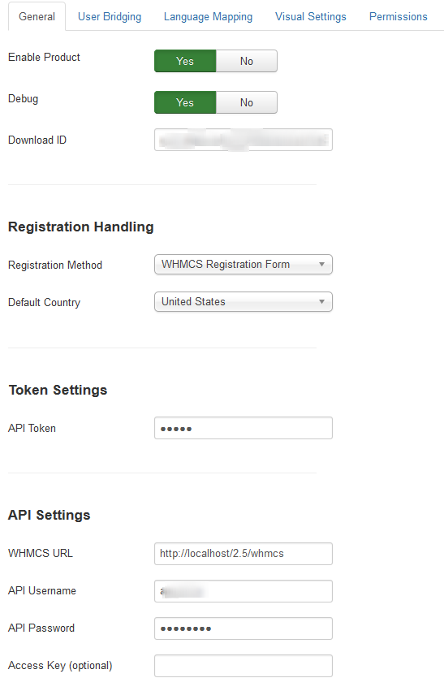

There are two locations for accessing settings for J!WHMCS Integrator, Joomla! and WHMCS.  This document concerns accessing the configuration values for the Joomla! portion of the installation.

### Accessing Settings

To access the settings for the J!WHMCS Integrator product in Joomla!, follow these steps:

1. Log into the backend of your Joomla CMS site using a Super Administrator account.
2. Click on Components > J!WHMCS Integrator
3. On the far right side you will see the Options button.  Click on that button.
4. You should now see the settings for the J!WHMCS Integrator.

### General Tab

The settings in the General Tab look similar to this:  
{japopup type="image" content="media/gitdocs/jwhmcs/installupgrade_guide/assets/jconfig-general.png" width="1050" height="330" title="Joomla! Configuration:  General Tab"}
{/japopup}

#### Global Settings

##### Enable Product

This is a global switch that controls the product on Joomla!.  If this is not enabled, the product will not operate at all.

##### Debug

This setting enabled the Dunamis debug bar which allows for easier troubleshooting and assists in determining issues should any arise.  The debug bar looks like this 

You can see it provides some useful information about what is happening including any calls to the WHMCS system.  You can click on the API Calls link in the bar to get more details about what is called and what is being returned.

##### Download ID

This is your Download ID which is available [from our site](jwhmcs/howtoguides/accessdownloadid.md).

#### Registration Settings

##### Registration Handling

This setting will tell your Joomla site to use either the WHMCS registration form or the native (or 3rd party) registration form in Joomla!.  Note that if you set this to WHMCS and on the WHMCS side you set the value to use Joomla, you could find yourself in an endless loop, so be sure your settings are consistent in the product.

##### Default Country

If you are using the Joomla! registration form, the J!WHMCS Integrator will add in the necessary address fields from WHMCS so that your users can completely register on both Joomla! and WHMCS.  This setting tells J!WHMCS Integrator what you expect to use as the default country in your system.

#### Token Settings

##### API Token

This setting is very important and must match what is set on the WHMCS side for the product.  This token is used to create an authentication hash when the system attempts to communicate from one side or the other.  The token is never passed from one system to the other via the request, but instead should be identical on both sides so the request can rebuild the authentication hash and verify that the request is legit.

#### API Settings

##### WHMCS URL

This setting is the URL to the front end of your WHMCS system.  This value MUST be a fully qualified domain.  An example of a FQDN is:

<code>http://www.jwhmcs.com/hosting/</code>

Not including the scheme or full path to your WHMCS will result in the system failing to operate properly

##### API Username / Password

These are configured in your WHMCS system.  To create the user, [follow these instructions](jwhmcs/howtoguides/createapiuser.md).  Be sure this is accurate.

##### Access Key (optional)

If your WHMCS system relies on an Access Key to authenticate API users, then you can enter it here.  Using the Access Key bypasses the need to have the IP Address of the system whitelisted in WHMCS. 