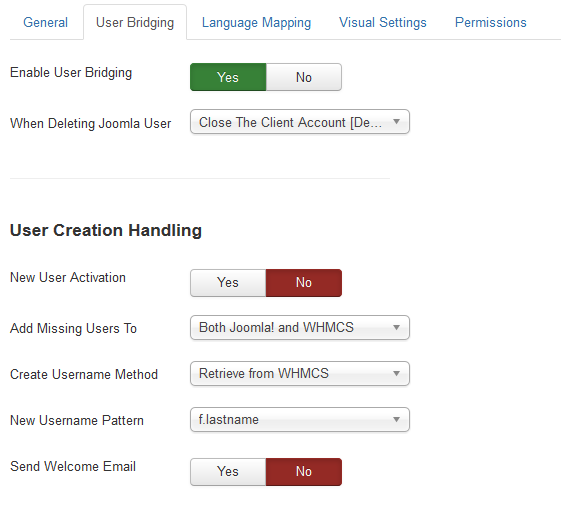
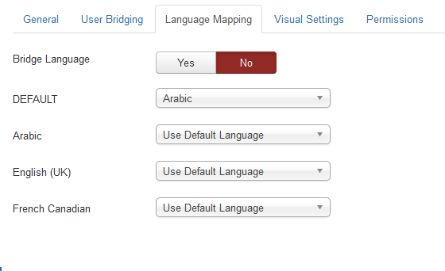
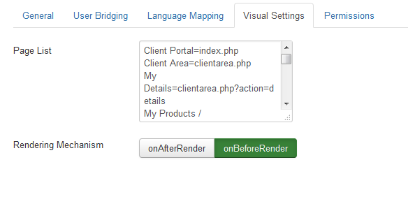

There are two locations for accessing settings for J!WHMCS Integrator, Joomla! and WHMCS.  This document concerns accessing the configuration values for the Joomla! portion of the installation.

### Joomla

* [Accessing Settings](#accessing-settings)
* [General Tab](#general-tab)
* [User Bridging Tab](#user-bridging-tab)
* [Language Mapping Tab](#language-mapping-tab)
* [Visual Settings Tab](#visual-settings-tab)

### Accessing Settings

To access the settings for the J!WHMCS Integrator product in Joomla!, follow these steps:

1. Log into the backend of your Joomla CMS site using a Super Administrator account.
2. Click on Components > J!WHMCS Integrator
3. On the far right side you will see the Options button.  Click on that button.
4. You should now see the settings for the J!WHMCS Integrator.

### General Tab

The settings in the General Tab look similar to this:  
{japopup type="image" content="media/gitdocs/jwhmcs/installupgrade_guide/assets/jconfig-general.png" width="547" height="851" title="Joomla! Configuration:  General Tab"}
{/japopup}

#### Global Settings

##### Enable Product

This is a global switch that controls the product on Joomla!.  If this is not enabled, the product will not operate at all.

##### Debug

This setting enabled the Dunamis debug bar which allows for easier troubleshooting and assists in determining issues should any arise.  The debug bar looks like this 

You can see it provides some useful information about what is happening including any calls to the WHMCS system.  You can click on the API Calls link in the bar to get more details about what is called and what is being returned.

##### Download ID

This is your Download ID which is available [from our site](jwhmcs/howtoguides/accessdownloadid.md).

#### Registration Settings

##### Registration Handling

This setting will tell your Joomla site to use either the WHMCS registration form or the native (or 3rd party) registration form in Joomla!.  Note that if you set this to WHMCS and on the WHMCS side you set the value to use Joomla, you could find yourself in an endless loop, so be sure your settings are consistent in the product.

##### Default Country

If you are using the Joomla! registration form, the J!WHMCS Integrator will add in the necessary address fields from WHMCS so that your users can completely register on both Joomla! and WHMCS.  This setting tells J!WHMCS Integrator what you expect to use as the default country in your system.

#### Token Settings

##### API Token

This setting is very important and must match what is set on the WHMCS side for the product.  This token is used to create an authentication hash when the system attempts to communicate from one side or the other.  The token is never passed from one system to the other via the request, but instead should be identical on both sides so the request can rebuild the authentication hash and verify that the request is legit.

#### API Settings

##### WHMCS URL

This setting is the URL to the front end of your WHMCS system.  This value MUST be a fully qualified domain.  An example of a FQDN is:

<code>http://www.jwhmcs.com/hosting/</code>

Not including the scheme or full path to your WHMCS will result in the system failing to operate properly

##### API Username / Password

These are configured in your WHMCS system.  To create the user, [follow these instructions](jwhmcs/howtoguides/createapiuser.md).  Be sure this is accurate.

##### Access Key (optional)

If your WHMCS system relies on an Access Key to authenticate API users, then you can enter it here.  Using the Access Key bypasses the need to have the IP Address of the system whitelisted in WHMCS. 

### User Bridging Tab

The settings in the User Bridging Tab look similar to this:  
{japopup type="image" content="media/gitdocs/jwhmcs/installupgrade_guide/assets/jconfig-user.png" width="561" height="512" title="Joomla! Configuration:  User Bridging Tab"}
{/japopup}

#### General Settings

##### Enable User Bridging

This setting permits you to bypass the J!WHMCS Integrator when doing any user management on the Joomla! side.  When this is disabled, users logging in from Joomla will not be logged into WHMCS, nor will they be able to edit their WHMCS profile settings from the Joomla user profile screen.

##### When Deleting Joomla User

This setting tells J!WHMCS Integrator what to tell WHMCS to do with the matching user in WHMCS when you delete the user in Joomla!.  Ideally you don't want to delete the user in WHMCS because there are billing and service records to maintain, so the default setting is to Close the Clients account in WHMCS.  This forbids the user from logging in on either system but maintains records in WHMCS.

#### User Creation Handling

##### New User Activation

If a user is created by J!WHMCS Integrator (either because they are created by WHMCS or because they are logging in for the first time in the system and they must be created in Joomla!), this setting tells J!WHMCS Integrator if you want to override the default Joomla! user account activation mechanism.  If you set this to No, then new users created by J!WHMCS Integrator will NOT be required to authenticate their email address prior to logging into the Joomla! system.  If you set this to Yes, then the default action that you have set in the user configuration of Joomla! will take place.

##### Add Missing Users To

This setting tells J!WHMCS Integrator that you intend to add missing users to one system, neither systems or both systems.  The default is to set this to create users on both Joomla! and WHMCS.  A user may be missing if they are created in WHMCS at the time of check out but for some reason Joomla didn't create the user then.  Or if you have only just recently installed the product and have users in WHMCS but not in Joomla! yet.

##### Create Username Method

When creating a new user in Joomla!, the J!WHMCS Integrator must know how to generate the username.  Since Joomla! doesn't necessarily use an email address for logging in and WHMCS doesn't by default ask for a username, the username can be created in a couple of ways.  The default setting is to defer to WHMCS, so whatever setting you have set in J!WHMCS Integrator for generating the username will be used.

##### New Username Pattern

This setting works with the previous setting, and is only used when the Create Username Method is set to Use Pattern Below.  This pattern will rely on information sent by the WHMCS system when creating the user to build the username.

##### Send Welcome Email

This setting will send the Joomla! system welcome email message when a user is created by J!WHMCS Integrator.  The default setting on this is No.

### Language Mapping Tab

The settings in the Language Mapping Tab look similar to this:  
{japopup type="image" content="media/gitdocs/jwhmcs/installupgrade_guide/assets/jconfig-language.png" width="560" height="342" title="Joomla! Configuration:  Language Mapping Tab"}
{/japopup}

##### Bridge Language

If you are using multiple languages in Joomla!, then you will want to enable this setting.  This setting will allow the system to append the language querystring variable to your WHMCS links so that when a user clicks on a WHMCS link, their language is carried over to WHMCS.

##### Default

This is the default language setting.  If you have enabled the Bridge Language setting, then this is what would be appended to your WHMCS URLs unless you map specific languages to WHMCS languages.

##### Other Languages

The rest of the settings on this tab depend on any languages you have installed in Joomla!.  If you have any configured, they will appear here, and will permit you to map from that Joomla! language to either the default language setting or to a specific language in WHMCS.

### Visual Settings Tab

The settings in the Visual Settings Tab look similar to this:  
{japopup type="image" content="media/gitdocs/jwhmcs/installupgrade_guide/assets/jconfig-visual.png" width="584" height="282" title="Joomla! Configuration:  Visual Settings Tab"}
{/japopup}

##### Page List

This setting allows you to predefine potential pages to link to.  This page map is used by the JWHMCS Integrator > Link Menu Item Type and will appear in the drop down list under Link Options.  To create your own links, you want to use a name with an equal sign followed by the URL to the page you are going to.  For example, suppose you have a product group in WHMCS you want to directly link to, you could do the following:

1. Get the group link from WHMCS.  This would be similar to cart.php?gid=4
2. Edit this setting and create a new line at the bottom like this <code>My Group=cart.php?gid=4</code>
3. Now when you go to create a NEW menu item in Joomla!, select the JWHMCS Integrator > Link Menu Type and you will see My Group in the available dropdown list.

Note that this will only work on NEW menu items, existing menu items do not rely on this setting.

##### Rendering Mechanism

When J!WHMCS Integrator pulls the Joomla! site to wrap around WHMCS, you can have it fire on one of two different events.  The OnBeforeRender event or the OnAfterRender event.  The onBeforeEvent would be faster as fewer plugins would have executed at that point, but the onAfterEvent could be useful as it should permit content replacement to take place.
