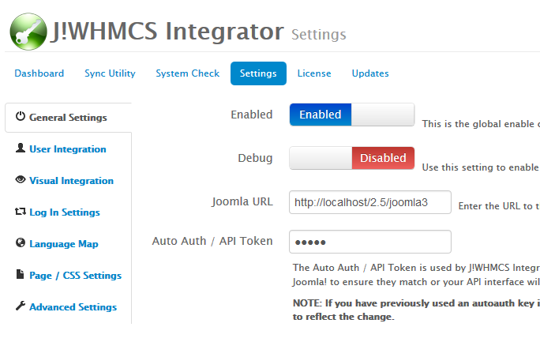
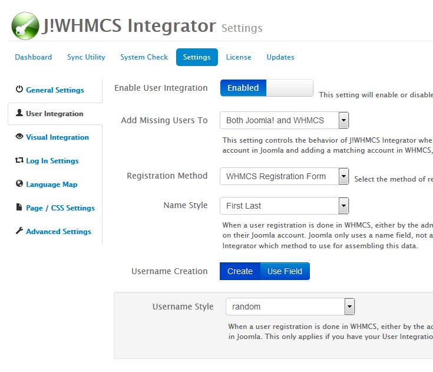
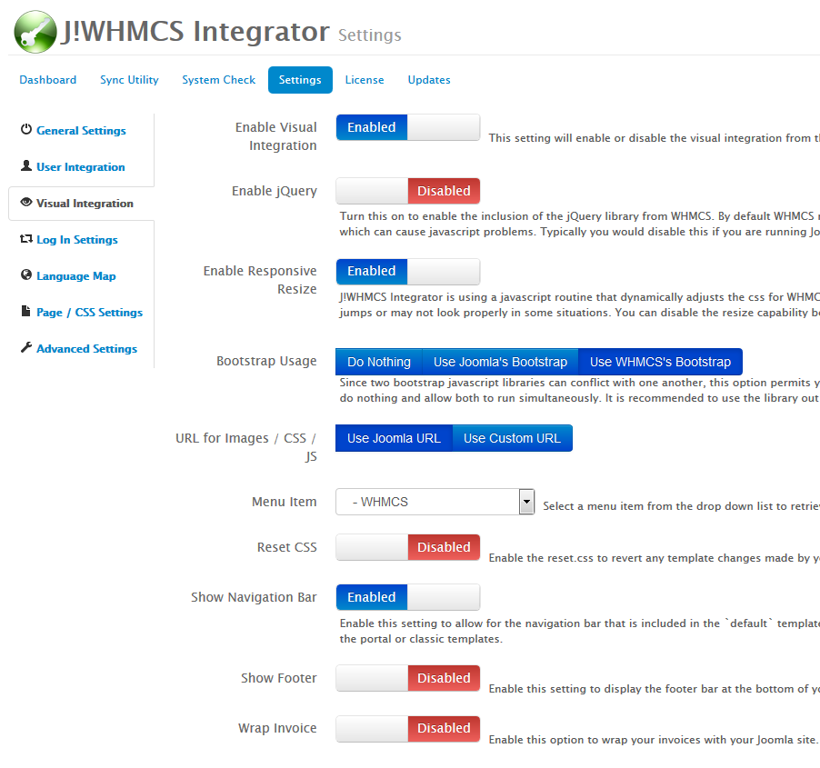
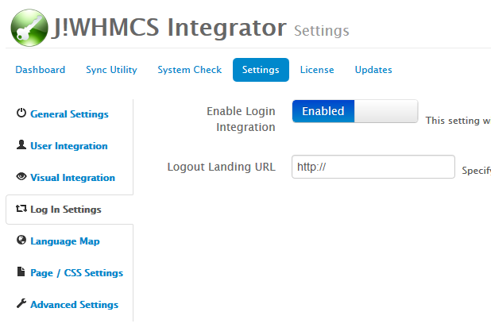
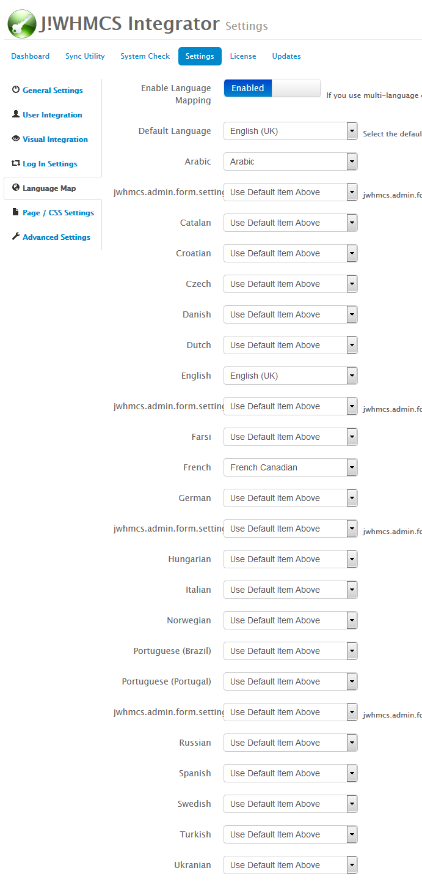
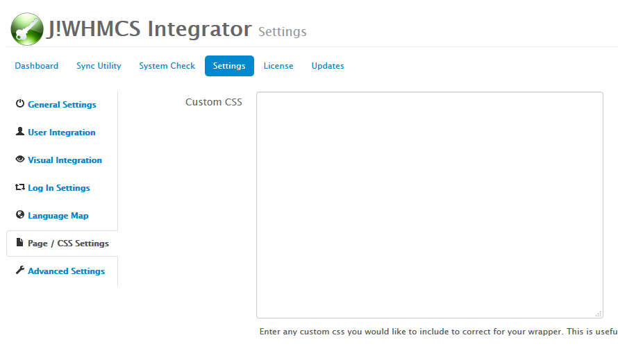
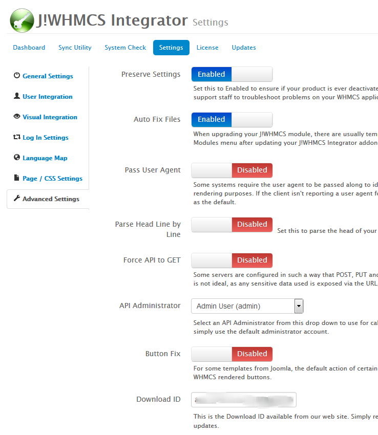

### Configuration In Depth:  WHMCS

There are two locations for accessing settings for J!WHMCS Integrator, Joomla! and WHMCS.  This document concerns accessing the configuration values for the WHMCS portion of the installation.

* [Accessing Settings](#accessing-settings)
* [General Tab](#general-tab)
* [User Bridging Tab](#user-bridging-tab)
* [Language Mapping Tab](#language-mapping-tab)
* [Visual Settings Tab](#visual-settings-tab)

### Accessing Settings

To access the settings for the J!WHMCS Integrator product in WHMCS, follow these steps:

1. Log into the backend of your WHMCS Application using an administrator account with permission to access the J!WHMCS Integrator module.
2. Navigate to Addons > J!WHMCS Integrator on the menu to get to the product.
3. Click on the Settings button.
4. You should now see the settings for the J!WHMCS Integrator.

### General Tab

The settings in the General Tab look similar to this:  
{japopup type="image" content="media/gitdocs/jwhmcs/installupgrade_guide/assets/wconfig-general.png" width="684" height="433" title="WHMCS Configuration:  General Tab"}
{/japopup}

##### Enabled

This is the global enable configuration setting. Turning the product off here turns off both user and visual integration regardless of their settings.

##### Debug

This setting enables the Dunamis debug bar which allows for easier troubleshooting and assists in determining issues should any arise.  The debug bar looks like this 

You can see it provides some useful information about what is happening including any calls to the Joomla! system.  You can click on the API Calls link in the bar to get more details about what is called and what is being returned.

##### Joomla URL

Enter the URL to the frontend of your Joomla web site. Do not include language routes such as /en/ or /fr/.  The setting MUST be a fully qualified domain name.  An example of a FQDN is:

<code>http://www.jwhmcs.com/</code>

Not including the scheme or full path to your Joomla! will result in the system failing to operate properly  

##### Auto Auth / API Token

The Auto Auth / API Token is used by J!WHMCS Integrator to communicate between WHMCS and Joomla. You will need to also enter the value you have here in your J!WHMCS Integrator settings in Joomla! to ensure they match or your API interface will not function between WHMCS and Joomla.

<strong>Warning!</strong> 
	NOTE: If you have previously used an autoauth key in your configuration file for WHMCS, then THIS WILL BE THE SAME VALUE! Changing this value will update your configuration.php file as well to reflect the change.

### User Integration Tab

The settings in the User Integration Tab look similar to this:  
{japopup type="image" content="media/gitdocs/jwhmcs/installupgrade_guide/assets/wconfig-user.png" width="735" height="631" title="WHMCS Configuration:  User Integration Tab"}
{/japopup}

##### Enable User Integration

This setting will enable or disable user integration from the WHMCS side of the product.

##### Add Missing Users To

This setting controls the behavior of J!WHMCS Integrator when dealing with users that don't have a matching account already in both systems when logging in and editing accounts. When editing an account in Joomla and adding a matching account in WHMCS, the user will still need to log in with their Joomla username for the first time in order to synchronize the passwords properly.

##### Registration Method

Select the method of registration you want to use on your site. You may select to use the native Joomla! registration form or the WHMCS registration form

##### Name Style

When a user registration is done in WHMCS, either by the admin or on the front end registration form or order form, this setting tells J!WHMCS Integrator what style to use for creating a users' name on their Joomla account. Joomla only uses a name field, not a full first name and last name field, so the name field must be assembled from data from WHMCS. This setting indicates to J!WHMCS Integrator which method to use for assembling this data.

##### Username Creation

You can select how you create the Joomla! username here.  The two options are to Create it using a style you select under Username Style below or to select a specific custom user field to grab the value from.  Using a custom field allows your customers to edit their username in their profile.

###### Username Style

When a user registration is done in WHMCS, either by the admin or on the front end registration form or order form, this setting tells J!WHMCS Integrator what style to use for creating a username in Joomla. This only applies if you have your User Integration enabled, and is only done when a user is registered through your WHMCS application.

###### Use Custom Field

You can choose to use a custom client field as the username when a user is created on the WHMCS portion of the integration. Type the exact name of the client field you are using below. Be sure to set it as required in the custom client field settings or user creation may fail.

### Visual Integration Tab

The settings in the Visual Integration Tab look similar to this:  
{japopup type="image" content="media/gitdocs/jwhmcs/installupgrade_guide/assets/wconfig-visual.png" width="902" height="845" title="WHMCS Configuration:  Visual Integration Tab"}
{/japopup}

##### Enable Visual Integration

This setting will enable or disable the visual integration from the WHMCS side of the product.

##### Enable jQuery

Turn this on to enable the inclusion of the jQuery library from WHMCS. By default WHMCS needs jQuery and does include it, however your Joomla template may already include a jQuery library in it which can cause javascript problems. Typically you would disable this if you are running Joomla! 3 or a YooTheme template which includes jQuery by default.

##### Enable Responsive Resize

J!WHMCS Integrator is using a javascript routine that dynamically adjusts the css for WHMCS elements based on the available width of the container. This javascript however may cause unnecessary jumps or may not look properly in some situations. You can disable the resize capability be disabling this option and to reverting to standard media query css calls for responsiveness in WHMCS.

##### Bootstrap Usage

Since two bootstrap javascript libraries can conflict with one another, this option permits you to choose to use the bootstrap library in Joomla (if loaded by Joomla), the library used by WHMCS, or to do nothing and allow both to run simultaneously. It is recommended to use the library out of WHMCS to ensure your application will work properly.

##### URL for Images / CSS / JS

This setting is used by J!WHMCS Integrator to repoint your images, css files and javascript files so that they will properly be found.  When the rendering takes place, your Joomla! files are based off the Joomla! base URL, but when on WHMCS, that URL is different, so J!WHMCS repoints your URLs.  This setting tells J!WHMCS Integrator to use either the Joomla URL or a custom URL to point images, css and javascript files.

You may want to use a custom URL if you have an SSL certificate on WHMCS but not Joomla! and your WHMCS installation is in a subdomain of your site instead of in a subfolder of Joomla!.

##### Menu Item

Select a menu item from the drop down list to retrieve from Joomla.  This menu item is retrieved and wrapped around WHMCS, so any modules and content assigned to it will appear as well.

##### Reset CSS

Enable the reset.css to revert any template changes made by your Joomla template so the WHMCS css work as expected.

##### Show Navigation Bar

Enable this setting to allow for the navigation bar that is included in the default WHMCS templates to be displayed when wrapping the default template.

##### Show Footer

Enable this setting to display the footer bar at the bottom of your templates. The footer includes the language selection dropdown box as well as the `copyright` notice.

##### Wrap Invoice

Enable this option to wrap your invoices with your Joomla site.

### Log In Settings Tab

The settings in the Log In Settings Tab look similar to this:  
{japopup type="image" content="media/gitdocs/jwhmcs/installupgrade_guide/assets/wconfig-login.png" width="618" height="422" title="WHMCS Configuration:  Log In Settings Tab"}
{/japopup}

##### Enable Login Integration

This setting will enable or disable the capability to log the user into both Joomla and WHMCS when logging in from WHMCS.

##### Logout Landing URL

Specify the URL you would like users to return to when logging out through WHMCS.  This value should be a fully qualified domain name.

### Language Map Tab

The settings in the Language Map Tab look similar to this:  
{japopup type="image" content="media/gitdocs/jwhmcs/installupgrade_guide/assets/wconfig-language.png" width="691" height="1450" title="WHMCS Configuration:  Language Map Tab"}
{/japopup}

##### Enable Language Mapping

If you use multi-language capabilities within Joomla, you can enable this to map your languages from WHMCS to Joomla.

##### Default Language

Select the default language to use when coming from an unknown WHMCS language.

### Page / CSS Settings Tab

The settings in the Page / CSS Settings Tab look similar to this:  
{japopup type="image" content="media/gitdocs/jwhmcs/installupgrade_guide/assets/wconfig-css.png" width="890" height="516" title="WHMCS Configuration:  Page / CSS Settings Tab"}
{/japopup}

##### Custom CSS

Enter any custom css you would like to include to correct for your wrapper. This is useful if for instance a rule from Joomla is breaking the appearance of something in WHMCS.

### Advanced Settings Tab

The settings in the Advanced Settings Tab look similar to this:  
{japopup type="image" content="media/gitdocs/jwhmcs/installupgrade_guide/assets/wconfig-advanced.png" width="738" height="850" title="WHMCS Configuration:  Advanced Settings Tab"}
{/japopup}

##### Preserve Settings

Set this to Enabled to ensure if your product is ever deactivated through the WHMCS > Addon Manager that the database settings will be preserved. This is advised if you ever allow third party support staff to troubleshoot problems on your WHMCS application.

##### Auto Fix Files

When upgrading your J!WHMCS module, there are usually template files that need to be corrected. Enabling this setting will automatically fix the template files when you visit the Setup > Addon Modules menu after updating your J!WHMCS Integrator addon module.

##### Pass User Agent

Some systems require the user agent to be passed along to identify the client properly. Set this to enable in order to pass your clients reported user agent along to your Joomla installation for visual rendering purposes. If the client isn't reporting a user agent for some reason, then `Mozilla/5.0 (Windows; U; Windows NT 5.1; en-US; rv:1.8.1.13) Gecko/20080311 Firefox/2.0.0.13` will be used as the default.

##### Parse Head Line By Line

Set this to parse the head of your Joomla document line by line (slightly slower but more accurate)

##### Force API to GET

Some servers are configured in such a way that POST, PUT and DELETE requests cannot be processed properly. This setting will force all API calls from WHMCS to Joomla to use the GET method. This is not ideal, as any sensitive data used is exposed via the URL, however for most users this should not be a concern.

##### API Administrator

Select an API Administrator from this drop down to use for calls to the local WHMCS interface. You can create a custom administrator for this purpose only to audit tasks done by J!WHMCS, but most simply use the default administrator account.

##### Button Fix

For some templates from Joomla, the default action of certain buttons such as the cpanel login button is disabled. This button fix option allows you to apply a simple javascript to correct this for WHMCS rendered buttons.

##### Download ID

This is your Download ID which is available [from our site](jwhmcs/howtoguides/accessdownloadid.md).
