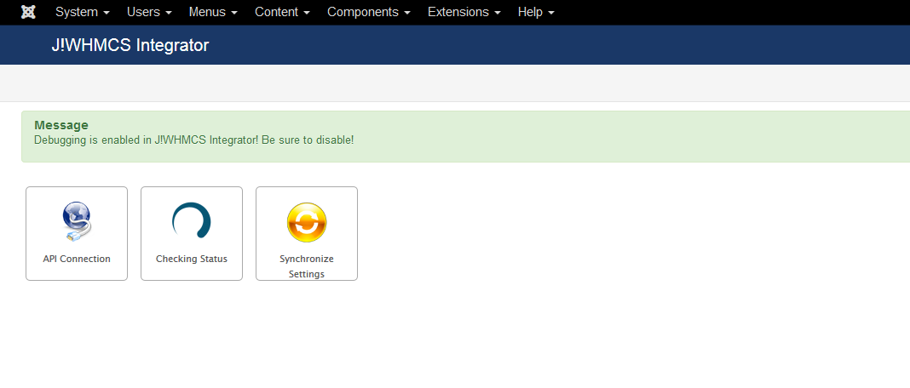

### What is a Minor Upgrade?

A minor upgrade is one that makes minor system adjustments and corrections for issues that have been discovered.  Our products are versioned so that the first digit in the version number essentially represents the product itself.  The second digit is a major revision, and the third digit is a minor revision.

A minor upgrade would be like moving from version 2.6.01 to version 2.6.02.  A major upgrade is going from version 2.5.15 to version 2.6.02.

### How to perform a Minor Upgrade - Automatic Upgrades

The easiest way to upgrade J!WHMCS Integrator is to use the built in upgrade feature.  This feature works on both the Joomla! and WHMCS portions of the product.

To use this feature, you will need your Download ID from our site.  To access your Download ID, please follow [this guide](jwhmcs/howtoguides/accessdownloadid.md).

#### WHMCS

To perform a minor upgrade from WHMCS:
# Log into the administrative control panel of your WHMCS application
# Navigate to Addons > JWHMCS Integrator on the top menu
# Click on the Updates button in the J!WHMCS Integrator page.
# You should see a screen similar to this
{japopup type="image" content="media/gitdocs/jwhmcs/howtoguides/assets/performupdate-01.png" width="1169" height="760" title="Perform Update in WHMCS"}
{/japopup}
# If there are updates, the system will indicate in the button.
# To update, just click the button

#### Joomla!

To form a minor upgrade from Joomla!:
# Log into the administrator area of your Joomla! CMS
# Navigate to Components > J!WHMCS Integrator
# You will see a screen similar to this
{japopup type="image" content="media/gitdocs/jwhmcs/howtoguides/assets/performupdate-02.png" width="1068" height="456" title="Perform Update in Joomla!"}
{/japopup}
# If there are updates, the upgrade button will indicate so, and you can click on that button to perform upgrades from within Joomla.

### How to perform a Minor Upgrade - Manual Upgrade

Another method for upgrading the system is to simply re-install the product.  This is done through the Joomla! Installation Manager in Joomla! as well as using FTP to upload files directly into WHMCS.  To perform this method of installation, simply follow these sections for uploading files [found here](jwhmcs/installupgrade_guide/newinstalls.md):
* Upload J!WHMCS Integrator Addon Module for WHMCS
* Install J!WHMCS Integrator Archive into Joomla!